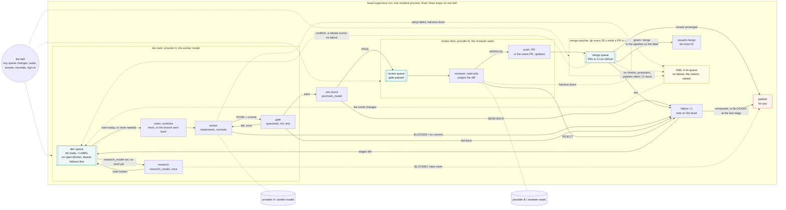

# bead-loop

Work [beads](https://github.com/steveyegge/beads) with any models, local or paid, in any
repo. One resident supervisor runs lanes side by side, one per provider — a **dev lane**
where the implementor model works a bead in its own worktree and a gate proves it, and a
**review lane** where reviewer seats judge the diff and push the PR — over three queues:
**dev**, **review**, **merge** (CI on GitHub), with a **merge watcher** on the third. A
bead whose files are not yet known can take an optional **research** round first, on a
model that can afford to read and write a brief; a gate that passes goes through a
**pre-check** before it spends a review round. Green merges, the bead closes. A bead sent
back from review or from CI returns to the dev queue with a note and one more
**failure**; enough failures move it to a stronger stage, the last one a metered provider
(Claude Code, an API). No model runs the loop; models do the jobs that need judgement,
and neither waits for the other — or for a clock.



| Role | What | Configured by |
| --- | --- | --- |
| Supervisor | `bead-supervisor`, one Rust binary (`src/`), resident | the global config and each repo's `.bead-loop.toml`; kept up by `bead-supervisor.timer` |
| Implementor | opencode agent `bead-worker` — or Claude Code, aider, a `command` | `[[stages]].worker`, one provider per stage; `research_model` for the optional research round |
| Reviewer | opencode agent `bead-reviewer`, read-only (or another harness, per seat) | `[[stages]].reviewer`, one or more seats, with `approvals`; `precheck_model` for the pre-check |
| Briefer | agent `bead-briefer`, read-only; one call when a bead is parked, and the second opinion (agent `bead-researcher`) on a researcher's `BLOCKED:` | `brief_model` |

Each model is a `[providers.NAME]` in the config, naming how it is reached, how many
sessions it runs at once and what it costs; `NAME/model` names it everywhere else — a
stage's `worker`, a seat, `research_model`, `brief_model`. [docs/config.md](docs/config.md)
lists the provider keys; [Your setup](#your-setup) below shows four of them end to end.

## How it runs

`bead-supervisor run` is one process that stays up. Each lane takes the top of its
queue, runs the round, moves the bead on, and takes the next; the merge watcher asks
GitHub about every PR in flight every 30 seconds. A loop with nothing to do blocks on
**the bell** — a one-second look at the queue directories, the repos' `.beads/` and a
`wake` file — and every producer rings it, so the GPU takes the next bead the second the
last one leaves it. Nothing waits on a clock while there is work, and nothing polls while
there is none.

Targets are configured in `.bead-loop.toml` under `[targets.NAME]` tables, with keys like
`path`, `base`, `base_remote`, `push_remote`, `pr_repo`, `setup`, `gate`, `merge`,
`merge_label`, `adopt`, `max_inflight`, `open_pr` and `pr_style`. A bead with a
`work:NAME` label picks the target of that name; the default target is the beads repo
itself. [docs/design-targets.md](docs/design-targets.md) explains the target concept
and how the PR is opened; [docs/config.md](docs/config.md)'s Targets section lists the
target keys and their defaults.

Targets are configured in `.bead-loop.toml` under `[targets.NAME]` tables, with keys like
`path`, `base`, `base_remote`, `push_remote`, `pr_repo`, `setup`, `gate`, `merge`,
`merge_label`, `adopt`, `max_inflight`, `open_pr` and `pr_style`. A bead with a
`work:NAME` label picks the target of that name; the default target is the beads repo
self. [docs/design-targets.md](docs/design-targets.md) explains the target concept
and how the PR is opened; [docs/config.md](docs/config.md)'s Targets section lists the
target keys and their defaults.

A bead's target can be configured with `merge = "external"` to let someone else merge
the PR, and `open_pr = "ask"` to let the operator open the PR. [docs/design-targets.md](docs/design-targets.md) explains
the target concept and how the PR is opened; [docs/config.md](docs/config.md)'s Targets section lists the
target keys and their defaults.

Lanes derive from the providers named by the stages, seats, `research_model` and
`brief_model`: one lane per provider, as wide as its `parallel`, in the order the
providers first appear — a round on one provider never holds another's queue, and a bead
escalated to a wider one runs at once. `[[lanes]]` in the global config groups providers
under a name of your choosing (`gpu`, `cpu`, `claude` on this box, see
[docs/examples/homelab.md](docs/examples/homelab.md)) when one lane per provider is not
the shape you want. Infrastructure failing — a server down, setup broken, CI silent — is
never the bead's failure: the bead is **held** with the reason until the world changes. A
bead the models cannot land is **parked** for you with a written brief: what happened,
why, and the question to answer.

## Layout

The three units (`bead-supervisor`, `bead-loop-ui`, `opencode-web`) run their command
through `flox activate -d @HERE@ --` (where `@HERE@` is the directory from which `install.sh`
is executed), so every tool resolves from `.flox/env/manifest.toml` the same way on every
box; `systemctl --user show -p Environment` carries no `PATH=` line. `flox activate` on a
warm env adds under 100ms.

## Install

`./install.sh` builds the binary (`cargo build --release`, through `flox activate` when
cargo is not on PATH), puts it in `~/.local/bin`, links `skills/` and `agents/` into
opencode, installs the user units, seeds `~/.config/bead-loop/config.toml`, and enables
+ starts the loop (`opencode-web.service`, `bead-loop-ui.service`, `bead-supervisor.timer`
— the timer is the keeper, see systemd/bead-supervisor.timer) so it is running when the
script returns and comes back on its own after a crash or a reboot. Re-running it (every
deploy) never interrupts a session in flight: `enable --now` only starts a unit that
isn't already up. At run time it needs `bd`, `git`, `gh`, `opencode` and `curl`; the UI
needs `node`. `flox activate` in this checkout provides all of them plus the Rust
toolchain.

The loop surviving a reboot with nobody logged in also needs **linger** for this user —
`install.sh` tries `loginctl enable-linger` itself and tells you if it couldn't (it needs
root): `sudo loginctl enable-linger $USER`, once.

Per repo: label the beads the model may work (`bd label add <id> delegate:local`; each
needs a DESCRIPTION naming the files and an ACCEPTANCE CRITERIA the worker can run — `bd
dep add B A` is the ordering; the `delegate` skill, linked into `~/.claude/skills` for
you, says what a bead needs before it goes), copy `bead-loop.example.toml` to `<repo>/.bead-loop.toml`
(the base branch, `setup`, `gate`, `merge`), add the repo to `repos` in the global
config, and have CI report a status on the repo's PRs with `gh` logged in. Every key:
[docs/config.md](docs/config.md).

## Your setup

- [docs/examples/homelab.md](docs/examples/homelab.md) — this box: two local providers,
  a `gpu`/`cpu`/`claude` lane each, Claude Code as the last stage.
- [docs/examples/laptop-ollama.md](docs/examples/laptop-ollama.md) — one local provider
  through opencode's Ollama support, a metered provider as the reviewer's second seat and
  the last stage.
- [docs/examples/api-only.md](docs/examples/api-only.md) — no local model, one metered
  provider wide enough to run several beads at once.
- [docs/examples/quorum.md](docs/examples/quorum.md) — three reviewer seats from three
  families, voting.

## Run

```bash
bead-supervisor doctor                                  # every dependency probed, red or green, one line each; --json for the page
bead-supervisor publish REPO ID [--title T] [--body-file F]   # open the PR an open_pr = "ask" round proposed and the merge mode `external` (maintainer merges) is also supported
```

The page, **<http://127.0.0.1:4097>**, shows the flow — the workflow as one graph, a band
per stage, every bead at the node it is at — the lanes, the scoreboard and **Needs you**
— every parked bead with its question, every held bead with its reason — with a lever
for each thing you would otherwise type.

## Docs

- [docs/config.md](docs/config.md) — every key; lanes per server; the stages; the merge modes
- [docs/state-machine.md](docs/state-machine.md) — one bead start to finish; every outcome, state and exit
- [docs/operating.md](docs/operating.md) — the page, the terminal, stop/restart/recover, the state on disk
- [docs/pipeline.md](docs/pipeline.md) — dogfood: the checks, Buildkite, the automerge label, the deploy
- [docs/design.md](docs/design.md) — why this shape; the harnesses (opencode, Claude Code, aider)

## License

[Functional Source License, Version 1.1, MIT Future License](LICENSE.md) (FSL-1.1-MIT).
Use it, read it, change it, run it inside your own team — everything except offering it as a
competing product or service. Each version becomes plain MIT two years after its release.
Contributions are accepted under the same license.
