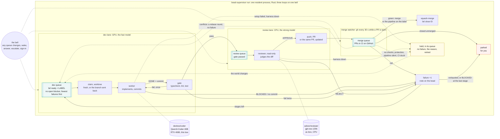

# bead-loop

Work [beads](https://github.com/steveyegge/beads) with local models in any repo. One
resident supervisor runs lanes side by side — a **dev lane** where the implementor model
works a bead in its own worktree and a gate proves it, and a **review lane** where the
reviewer model judges the diff and pushes the PR — over three queues: **dev**, **review**,
**merge** (CI on GitHub), with a **merge watcher** on the third. Green merges, the bead
closes. A bead sent back from review or from CI returns to the dev queue with a note and
one more **failure**; enough failures move it to a stronger stage, the last one Claude
(Sonnet). No model runs the loop; models do the two jobs that need judgement, and neither
waits for the other — or for a clock.



| Role | What | Where it runs here |
| --- | --- | --- |
| Supervisor | `bead-supervisor`, one Rust binary (`src/`), resident | `bead-supervisor.service` on this box, kept up by `bead-supervisor.timer` |
| Implementor | opencode agent `bead-worker` | `devbox/coder` — Qwen3-Coder-30B on the RTX 4080; `acbox/coder` (Qwen3-Coder-Next 80B on ac-box's CPU) as the second stage; `claude/sonnet` as the last |
| Reviewer | opencode agent `bead-reviewer`, read-only | `acbox/reviewer` — gpt-oss-120b on ac-box's CPU: a different family from every worker, so it catches what the Qwen models share |
| Briefer | agent `bead-briefer`, read-only; one call when a bead is parked | `brief_model`: the last stage's worker (`claude/sonnet` here) |

The models are opencode providers in `~/.config/opencode/opencode.json`; any
`provider/model` works in their place.

## How it runs

`bead-supervisor run` is one process that stays up. Each lane takes the top of its
queue, runs the round, moves the bead on, and takes the next; the merge watcher asks
GitHub about every PR in flight every 30 seconds. A loop with nothing to do blocks on
**the bell** — a one-second look at the queue directories, the repos' `.beads/` and a
`wake` file — and every producer rings it, so the GPU takes the next bead the second the
last one leaves it. Nothing waits on a clock while there is work, and nothing polls while
there is none.

Lanes are keyed by **model server**, not role, with `[[lanes]]` in the global config
(`gpu`, `cpu`, `claude` here): a round on the CPU box never holds the GPU's queue, and a
bead escalated to Claude runs at once. Infrastructure failing — a server down, setup
broken, CI silent — is never the bead's failure: the bead is **held** with the reason
until the world changes. A bead the models cannot land is **parked** for you with a
written brief: what happened, why, and the question to answer.

## Install

`./install.sh` builds the binary (`cargo build --release`, through `flox activate` when
cargo is not on PATH), puts it in `~/.local/bin`, links `skills/` and `agents/` into
opencode, installs the user units, seeds `~/.config/bead-loop/config.toml`, and enables
+ starts the loop (`opencode-web.service`, `bead-loop-ui.service`, `bead-supervisor.timer`
— the timer is the keeper, see systemd/bead-supervisor.timer) so it is running when the
script returns and comes back on its own after a crash or a reboot. Re-running it (every
deploy) never interrupts a session in flight: `enable --now` only starts a unit that
isn't already up. At run time it needs `bd`, `git`, `gh`, `opencode` and `curl`; the UI
needs `node`. `flox activate` in this checkout provides all of them plus the Rust
toolchain.

The loop surviving a reboot with nobody logged in also needs **linger** for this user —
`install.sh` tries `loginctl enable-linger` itself and tells you if it couldn't (it needs
root): `sudo loginctl enable-linger $USER`, once.

Per repo: label the beads the model may work (`bd label add <id> delegate:local`; each
needs a DESCRIPTION naming the files and an ACCEPTANCE CRITERIA the worker can run — `bd
dep add B A` is the ordering; the `delegate` skill, linked into `~/.claude/skills` for
you, says what a bead needs before it goes), copy `bead-loop.example.toml` to `<repo>/.bead-loop.toml`
(the base branch, `setup`, `gate`, `merge`), add the repo to `repos` in the global
config, and have CI report a status on the repo's PRs with `gh` logged in. Every key:
[docs/config.md](docs/config.md).

## Run

```bash
bead-supervisor run                                     # what the service runs: the resident loop
bead-supervisor --dry-run work ~/src/repo               # the bead the dev lane would take, and its prompt
bead-supervisor --local work ~/src/repo inq-abc.1       # implement, gate, review; no push
bead-supervisor work ~/src/repo                         # one bead through both lanes, to a PR
bead-supervisor watch                                   # the lanes, queues, parked and held, every 5 s
bead-supervisor answer ~/src/repo inq-abc.1 "use --dry-run"   # reply to a parked bead; back to the dev queue
bead-supervisor escalate ~/src/repo inq-abc.1           # to the last stage (Claude) now
bead-supervisor open ~/src/repo inq-abc.1               # you + Claude Code in the bead's worktree, question in hand
bead-supervisor recover                                 # what run does first, by hand
bead-supervisor doctor                                  # every dependency probed, red or green, one line each; --json for the page
systemctl --user enable --now opencode-web.service bead-loop-ui.service bead-supervisor.timer
sudo loginctl enable-linger $USER                       # the units survive logout
```

`install.sh` already started the units (see Install); by hand, the same command it runs
is `systemctl --user enable --now opencode-web.service bead-loop-ui.service
bead-supervisor.timer`. `systemctl --user stop bead-supervisor.timer` (or the page's
**Off**) takes the loop back down; `gpu-mode game`/`work` toggles it and the local model
server together where that command exists.

`--help` lists the rest (`tick`, `wake`, `pause`, `priority`, `recover`, `stats`, `log`).
The page, **<http://127.0.0.1:4097>**, shows the lanes, the scoreboard, the queues and
**Needs you** — every parked bead with its question, every held bead with its reason —
with a lever for each thing you would otherwise type.

## Docs

- [docs/config.md](docs/config.md) — every key; lanes per server; the stages; the merge modes
- [docs/state-machine.md](docs/state-machine.md) — one bead start to finish; every outcome, state and exit
- [docs/operating.md](docs/operating.md) — the page, the terminal, stop/restart/recover, the state on disk
- [docs/pipeline.md](docs/pipeline.md) — dogfood: the checks, Buildkite, the automerge label, the deploy
- [docs/design.md](docs/design.md) — why this shape; the harnesses (opencode, Claude Code, aider)

## License

[Functional Source License, Version 1.1, MIT Future License](LICENSE.md) (FSL-1.1-MIT).
Use it, read it, change it, run it inside your own team — everything except offering it as a
competing product or service. Each version becomes plain MIT two years after its release.
Contributions are accepted under the same license.
