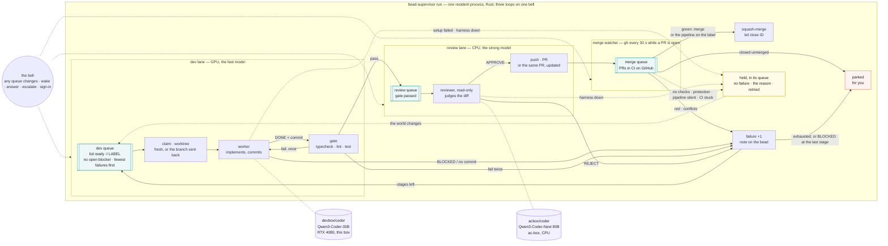

# bead-loop

Work [beads](https://github.com/steveyegge/beads) with local models in any repo: one
resident supervisor runs two lanes side by side — a **dev lane** where the implementor
model works a bead in its own worktree and a gate proves it, and a **review lane** where
the reviewer model judges the diff and pushes the PR — over three queues: **dev**,
**review**, **merge** (CI on GitHub), with a **merge watcher** on the third. Green
merges, the bead closes. A bead sent back from review or from CI returns to the dev queue
with a note and one more **failure**; enough failures move it to a stronger stage, the
last one Claude (Sonnet). No model runs the loop; models do the two jobs that need
judgement, and neither waits for the other — or for a clock.



| Role | What | Where it runs here |
| --- | --- | --- |
| Supervisor | `bead-supervisor`, one Rust binary (`src/`), resident | `bead-supervisor.service` on this box, kept up by `bead-supervisor.timer` |
| Implementor | opencode agent `bead-worker` | `devbox/coder` — Qwen3-Coder-30B on the RTX 4080; `claude/sonnet` as the last stage |
| Reviewer | opencode agent `bead-reviewer`, read-only | `acbox/coder` — Qwen3-Coder-Next 80B Q8 on ac-box's CPU |

Both models are opencode providers in `~/.config/opencode/opencode.json`; any
`provider/model` works in their place. The fast model implements; the slow, stronger
model gets one call per PR, where it pays.

## How the loop waits

`bead-supervisor run` is one process that stays up. Inside it, three loops:

- the **dev lane** takes the top of the dev queue, claims it, runs the worker and the
  gate, and puts the bead in the review queue — then the next one, as long as the dev
  queue has beads;
- the **review lane** takes the top of the review queue, runs the reviewer, and on
  APPROVE pushes the PR into the merge queue — then the next one;
- the **merge watcher** asks GitHub about every PR in flight every 30 seconds — merges
  green (or waits for the pipeline to), sends red or conflicting back to dev, closes the
  bead on MERGED — and does nothing while there is no PR.

A loop with nothing to do blocks on **the bell**: a one-second look at the queue
directories, the repos' `.beads/`, and a `wake` file, with a sixty-second heartbeat in
case a change was missed. Every producer rings it — a gate passing, an APPROVE, a
send-back, a merge, `answer`, `escalate`, Reopen, Sign in, `bead-supervisor wake` — so
the GPU takes the next bead the second the last one leaves it, and the bead a reviewer
rejects is back under the worker within a second. Nothing waits on a clock while there is
work, and nothing polls while there is none.

The lanes walk the repos **round-robin** — each pass starts one repo later than the last,
so no repo is always last — and a repo made the **priority** (`bead-supervisor priority
REPO`, or ★ on the page) goes first on every pass until you clear it.

The loop reads the world afresh on every round (both config files, bd, the state dir), so
an edit takes effect on the next round. The binary watches its own path: after a deploy
puts a new one there, the running loop re-execs it at the next moment both lanes are
idle. `systemctl stop` aborts the model sessions the lanes are on; the next start
**recovers** first — stale lane markers go, orphan sessions are aborted, and a dev round
the stop cut short is back in the dev queue with no failure charged.

`bead-supervisor tick` is the same lanes for one pass: reconcile, both lanes until both
queues drain and both lanes idle, reconcile again, exit — for hand runs and the test
suite. `--once` makes one pass of each lane in turn; `--serial` runs the lanes one after
the other; `lane dev` or `lane review` runs one lane by itself.

## Layout

```
src/                      the supervisor: config, state, the rounds, the merge queue, the lanes, status
Cargo.toml                one binary, bead-supervisor; serde_json, toml, libc
skills/beads/             bd syntax                        -> ~/.config/opencode/skills/beads
skills/bead-workflow/     one bead, start to finish        -> ~/.config/opencode/skills/bead-workflow
agents/bead-worker.md     implementor agent                -> ~/.config/opencode/agents/
agents/bead-reviewer.md   reviewer agent                   -> ~/.config/opencode/agents/
bin/bead-loop-ui          the web UI server (node)         -> ~/.local/bin/
ui/index.html             the page it serves
systemd/                  the loop's service and its keeper timer, opencode-web and bead-loop-ui services,
                          the deploy timer and its service
scripts/                  ci.sh (the steps, with the cargo cache), ci-merge.sh (automerge), deploy.sh (the pull)
bead-loop.example.toml    per-repo config                  -> <repo>/.bead-loop.toml
.flox/env/manifest.toml   flox: every tool above, pinned, cargo included; services for a box without systemd
docs/                     loop.mmd (the diagram above), state-machine.md (every state, every exit),
                          design-resident-loop.md, design-lanes-per-server.md
```

`./install.sh` builds the binary (`cargo build --release`, through `flox activate` when
cargo is not on PATH), installs it to `~/.local/bin`, makes the links, installs the units
(re-runnable; the deploy runs it). The supervisor needs `bd`, `git`, `gh`, `opencode` and
`curl` at run time; the UI needs `node`. **`flox activate`** in this checkout provides all of
them plus the Rust toolchain, and puts `target/release`, `target/debug` and `bin/` on
PATH; on a machine without the systemd units, `flox services start` runs the same three
things (`opencode-web`, `ui`, `loop`). Repo-specific skills (how to verify, house style,
vocabulary) stay in each repo under `.agents/skills/` or `.opencode/skills/`; the
workflow skill tells the worker to look for them.

## Per repo

1. Label the beads the model may work: `bd label add <id> delegate:local`.
   A bead needs a DESCRIPTION naming the files and an ACCEPTANCE CRITERIA the
   worker can run; the workflow skill turns anything vaguer into a `BLOCKED:` note.
   **Dependencies are the ordering**: `bd dep add B A` keeps B out of the dev queue until
   A is closed — that is, merged — and B's worktree then forks from a base that has A.
2. Copy `bead-loop.example.toml` to `<repo>/.bead-loop.toml`: the label, base branch, `setup`
   (what a fresh worktree needs, e.g. `npm ci`), `gate` (fast local proof),
   `review_model`, `merge`.
3. Add the repo to `repos` in `~/.config/bead-loop/config.toml`. Everything else in
   that file is a default the repo file may override; the models and `[[stages]]`
   usually live there once, not per repo.
4. On GitHub: CI that reports a status on PRs. `gh` must be logged in. By default
   (`merge = "auto"`) the supervisor never asks GitHub to auto-merge: the watcher merges
   once every reported check is green, and holds the bead for you while none is reported.
   Branch protection, where the plan allows it, is a second lock.
5. Optional, `merge = "pipeline"`: the loop puts a label on each PR it opens or adopts
   (`merge_label`, default `automerge`) and merging is the pipeline's job — it merges
   the moment its own run is green, and the loop never calls `gh pr merge`. The watcher
   sees `MERGED` and closes the bead. The label must exist in the repo; if GitHub refuses
   it, that is noted on the bead and the bead is held for you.
   (GitHub's own auto-merge is not used: private repos need a paid plan for it.)

## Config

Two TOML files, every key optional. A key in the repo file wins over the same key in
the global one; the global one wins over the default. Anything may go in either.

| Key | Default | What |
| --- | --- | --- |
| `repos` | `[]` | global only: the repos the lanes walk, `~` allowed |
| `label` | `"delegate:local"` | `bd ready -l LABEL` picks the work; the loop claims, notes and closes beads as this actor, not as you (`BEADS_ACTOR` in its environment overrides) |
| `base` | origin's HEAD | branch to fork from and PR into |
| `setup` | none | runs in a fresh worktree before the worker (`npm ci`); not again on a branch sent back. It failing holds the bead, no failure: setup runs on the base, so it cannot be the bead's fault |
| `gate` | none (CI is the gate) | runs after the worker, before the review queue; one fix round on failure |
| `model` | none | the dev lane's worker when no `[[stages]]` table applies. The name picks the harness: `provider/model` runs in opencode, `claude/<alias>` in Claude Code, `aider:provider/model` in aider on that opencode provider's server (see Harnesses) |
| `review_model` | none (no review) | the review lane's model when no `[[stages]]` table applies; none: straight to PR |
| `[[stages]]` | one stage of `model`/`review_model`, `failures = 3` | `worker`, `reviewer`, `failures` (1: how many send-backs this stage absorbs before the next takes over; `attempts` still reads), `timeout` (`worker_timeout`), in order |
| `on_exhaust` | `"park"` | after the last stage: `park` for you, or `repeat` the stages |
| `conflict_worker` | the last stage's worker | who rebases a PR that conflicts with the base (see the outcome table); a rebase is judgement, so the strong model by default |
| `merge` | `"auto"` | `auto`: the watcher merges on green · `pipeline`: the loop labels, CI merges · `manual`: PR only, the bead held for you once green |
| `merge_label` | `"automerge"` | the label `pipeline` puts on each PR |
| `adopt` | `true` | open `bead/*` PRs from anyone join the loop |
| `max_inflight` | none | a cap on PRs in the merge queue before the dev lane pauses. Unset, there is no cap: bd's dependencies are the only gate on the dev lane, and the queues absorb the rest. Set it for a repo whose CI is the scarce thing |
| `worker_timeout` | `3600` | seconds per model session |
| `attach` | none | an opencode server url; sessions run there and stream in its web UI |

`bead-loop.example.toml` is the repo file with every key annotated; `install.sh` seeds
the global one. A file that does not parse stops the run with its name, rather than
silently running with defaults.

## Watching it

**<http://127.0.0.1:4097>** — `bead-loop-ui.service`, one page, pushed every change (an
event stream; nobody presses refresh):

- **The header**: the loop — up since when and what it is on, or down — with **Wake**,
  **Stop** (the keeper brings it back in a minute: a breather) and **Off** (keeper too:
  down until you start it); the GPU switch; Claude's sign-in.
- **Per repo, first and large, the two lanes**: what the **dev lane** is on and what the
  **review lane** is on — id, title, its failure count and stage, the live session's model,
  when it last produced output, a link into it, Abort — or why a lane is idle (queue
  empty; every bead in it held; waiting on CI under a cap). **★ make priority** on the
  repo's heading puts it first on every pass.
- **The three queues in their order**: **dev** (#1 is next; each bead's failures and the
  stage that puts it on), **review** (how long each has waited), **merge** (each PR with
  GitHub's word on it — CI running m/n, red with the failing check, green, merged,
  conflicting — asked once a minute). Then **Needs you** — the human queue: each bead
  **parked** with the question it stopped on (the `BLOCKED:` line, the last rejection,
  the failing check), in full, and the ways out: **Answer & resume** (your reply goes on
  the bead, the bead returns to the dev queue at the stage it stopped on with that round
  forgiven, the next round reads the answer), **Work with Claude** (the last stage, now),
  **Reopen** (as is), or the one-line command that opens an interactive Claude Code
  session in the bead's worktree with the bead and the question as the first prompt.
  Under those, each bead **held** — still in its queue, waiting on something outside the
  loop, with the reason and where it sits; nothing to press, it clears itself when the
  world changes. Only when there is one, a session the server is still running that is
  on no lane (an orphan of a killed round, a hand-run `work`), with Abort.
- **The supervisor's log**, live.

The levers, each one command you would otherwise type: **Wake**, **Stop / Start / Off**,
**Pause / Resume lane** (that lane starts no new round; the other goes on — drain review,
or hold the CPU box; resume is instant), **★ priority** per repo, **Work with Claude** on
any bead (to the last stage and back into the dev queue now, ahead of its failure count;
`bead-supervisor escalate REPO ID`), and **Sign in** in the header when `claude` is signed
out — a banner, since a `claude/*` round cannot run then: such beads wait in their queue
(marked so) rather than burn a failure, and Work with Claude is off. Sign in runs `claude
auth login` for you — open the link it shows, sign in, paste the code back into the page
— and rings the bell when it is done. **Abort** on any busy or orphan session, **Reopen**
on a parked bead, and — where the box has a `gpu-mode` command (this workstation does:
`game` stops the loop and the local model server to free the GPU, `work` starts them
again) — a **Work / Game** switch, run as `sudo -n gpu-mode`, so sudoers must allow it
without a password. The server binds to loopback and refuses cross-site requests; it
needs `node`, and `systemctl`/`journalctl` for the units and log (without them, those
parts say so and the rest works).

Same thing in a terminal:

```bash
bead-supervisor watch                                     # the screen below, every 5 s (BEAD_LOOP_WATCH=N)
bead-supervisor status                                    # the same, once
bead-supervisor --json status                             # one JSON object per repo: what the UI reads
```

```
05:41:12   bead-supervisor watch (every 5s, ctrl-c to stop)

05:39:22 inquire-platform: dev: bead inq-ufz.13 — grading.dlq: 30-day retention (0 failures, worker devbox/coder, reviewer acbox/coder)
05:39:32 inquire-platform: review: inq-85h.5 by acbox/coder (1 failures)
05:40:01 inquire-platform: inq-85h.5: review approved
05:40:03 inquire-platform: opened https://github.com/imkarrer/inquire-platform/pull/44

inquire-platform  label=delegate:local base=master merge=pipeline stages=devbox/coder⇢acbox/coder×3 → acbox/coder⇢acbox/instruct×2 → claude/sonnet⇢claude/sonnet×1  [priority]
  dev lane:    inq-ufz.13 grading.dlq: 30-day retention as a per-topic config (2m)
  review lane: idle
  dev queue (4):
    1   inq-5rm.11     0× devbox/coder   scripts/*.mjs: replace the never-firing process.on('exit') pg cleanup
    2   inq-8gg.10     1× devbox/coder   packages/domain bands: BAND_CUTS keyed by (rubricVersion, graderModel)
    3   inq-h2i.8      1× devbox/coder   Gate a Claimed Session to its owner
    4   inq-c0t.23     4× acbox/coder    scripts/lib/gate.mjs: Composite spread ratio, tail rank correlation
  review queue (1):
    1   inq-c0t.28     0× devbox/coder   ladderVersion: blind ratings are evidence for the ladder text
  merge queue (1):
    inq-85h.5      https://github.com/imkarrer/inquire-platform/pull/44
  parked: inq-8gg.8
  held (waiting on you or the world; still in its queue):
    inq-h2i.7      [merge] https://github.com/imkarrer/inquire-platform/pull/41 reports no CI checks; merge it yourself or set merge = "manual"
```

The last supervisor log lines, then per repo: what each lane is on, the three queues in
the order the lanes take them (position, id, failures, the stage's worker, title), the
merge queue's PRs, the parked and held beads — and any session the attached opencode
server is still running that is on no lane, with its state, agent, model, when it last
produced anything, and the web UI url that opens it.

`busy` with a stale "ago" is the slow model thinking: a cold 20k-token prompt is ~2.5
minutes of prefill on the 80B before its first token. **`ORPHAN`** is a session the
server calls busy with no `opencode run` client left on this box: with `attach`, killing
the client does not stop the server-side session, and on a one-model box it starves the
next review. The loop aborts its own sessions on the server when the client dies — on
`worker_timeout`, on `systemctl stop`/`restart` (the TERM handler), at start (recover)
and before it recreates a worktree — so an orphan means something else killed the client
(`kill -9`, a crash); the line under it is the command that stops it.

Also:

```bash
journalctl --user -u bead-supervisor.service -f -o cat    # stage transitions, one line each, live
bead-supervisor log ~/src/repo [bead-id]                  # the newest session's log, one line per tool call
```

The web UI itself, <http://127.0.0.1:4096> (`opencode-web.service`): with
`attach = "http://127.0.0.1:4096"` in the global config every worker and reviewer session
runs inside that server and streams there live, titled by bead, with the diff.

State lives in `~/.local/state/bead-loop/<repo>/`: `inflight/<id>` (the PR url),
`logs/<id>.<stamp>.*` (setup, worker, gate, reviewer output per attempt), `wt/<id>`
(the worktree while a bead is on a lane or waiting for review), `review/<id>` (the review
queue: the worker's last words), `failures/<id>` (+ `.notes`, the history), `held/<id>`
(the reason a bead waits), `lane.dev` / `lane.review` (the bead each lane is on); and
beside them `wake` (the bell), `priority`, `pause.dev` / `pause.review`.

## Run

```bash
bead-supervisor --dry-run work ~/src/repo               # the bead the dev lane would take, and its prompt
bead-supervisor --local work ~/src/repo inq-abc.1       # implement, gate, review; no push
bead-supervisor work ~/src/repo                         # one bead through both lanes, to a PR
bead-supervisor tick                                    # one pass to idle: reconcile, both lanes, reconcile
bead-supervisor run                                     # what the service runs: the resident loop
bead-supervisor wake                                    # ring the bell
bead-supervisor priority ~/src/repo                     # this repo first on every pass; `priority none` clears
bead-supervisor pause review                            # that lane starts no new round until resume
bead-supervisor answer ~/src/repo inq-abc.1 "use --dry-run"   # reply to a bead in the human queue; back to dev
bead-supervisor open ~/src/repo inq-abc.1               # you + Claude Code in the bead's worktree, question in hand
bead-supervisor recover                                 # what run does first, by hand
systemctl --user enable --now opencode-web.service bead-loop-ui.service bead-supervisor.timer
sudo loginctl enable-linger $USER                       # the units survive logout
```

## Lifecycle of one bead

A **round** is one pass through the two lanes: worker → gate (one fix round on failure)
→ reviewer → PR. Three things end a round early and send the bead **back to the dev
queue**, each with a note on the bead saying exactly what happened and **one more
failure** on its count:

- the dev lane itself: the worker says `BLOCKED:`, makes no commit, times out, or the
  gate fails twice — the branch is removed and the next round starts fresh;
- the review lane: `REJECT:` — the branch and its worktree are *kept*; the next round's
  worker is told to fix its commit in place, and the reviewer sees the fix on top;
- the merge queue: CI red — same branch, kept; the next round's push updates the same PR.

Two send-backs are not failures. A PR that **conflicts with the base** is nobody's
mistake: it goes back to the dev queue on its branch with a rebase order, and that
round's worker is `conflict_worker` — the last stage's (Sonnet) by default, because
resolving a conflict is judgement about two intents, not typing. And **infrastructure is
never the bead's failure**: setup failing, a model harness exiting with nothing said (its
server down), `gh` or the push refusing — the round did not happen. The bead stays in its
queue **held** with the reason, the lane moves on to the next bead, and the held one is
tried again five minutes later (`BEAD_LOOP_HOLD_BACKOFF`). With the 30B down, the old
loop would have sent every ready bead back one stage in minutes; this one holds them all
and says why.

The failure count is what chooses the **stage**, the `[[stages]]` tables in the config:

```toml
on_exhaust = "repeat"

[[stages]]
worker = "devbox/coder"
reviewer = "acbox/coder"
failures = 3

[[stages]]
worker = "acbox/coder"
reviewer = "acbox/instruct"
failures = 2
timeout = 14400

[[stages]]
worker = "claude/sonnet"
reviewer = "claude/sonnet"
failures = 1
```

Read: a bead starts on the fast GPU worker reviewed by the 80B and stays there for its
first three failures; the fourth and fifth send it to the 80B implementing with the
*other* 80B reviewing (four-hour timeout); the sixth to Claude; then, with `repeat`,
around again until it lands. So "when does something get evicted to Claude" is one
number: the sum of `failures` above the Claude stage. A stage may name `claude/<alias>`
(`claude/sonnet`, `claude/opus`): that round runs in Claude Code (`claude -p`) instead
of opencode, the agent file's body as its system prompt, tools by role — the frontier
model gets only what the local ones could not land. It needs `claude` on PATH and logged
in once (`claude`, then `/login`); the skills are linked into `~/.claude/skills` by
`install.sh`. (`attempts` is the older name for `failures` and still reads.)

Both queues are ordered **fewest failures first**, then bd's own order: everything is
tried once before anything is tried twice, and a bead that keeps failing gets out of the
way of the ones that do not. The next round's worker reads the notes of the earlier ones.

Three things put a bead in the **human queue** as *parked* (`in_progress`, no more rounds
until you act): the stages are exhausted with `on_exhaust = "park"`, or the *last* stage
says `BLOCKED:` — a claim in the bead is false, or a decision is yours — and a PR closed
unmerged. The UI shows the question and takes the answer; `bead-supervisor answer` and
`open` are the same from a terminal. A bead *held* is in the human queue too, beside them,
with nothing to press.

**One place.** A bead is in exactly one of: the dev queue, a lane, the review queue, the
merge queue, parked. The dev lane never takes a bead that is in review or under a PR,
whatever bd's status says, and `answer`, `escalate` and Reopen refuse a bead in the
merge queue — its PR is what moves it.

## PRs from anyone

The watcher also **adopts** any open PR on a `bead/<id>…` branch it did not open —
another session's, or yours by hand. It treats it like its own: merged on green under
`auto`, labelled for the pipeline under `pipeline`, and the bead the branch names closes.
Adopted PRs cost CI, not the model, so they do not count toward `max_inflight`; red or
conflicting, they are held with a note and left to whoever opened them. `adopt = false`
turns it off.

## What each outcome does to the bead

| Outcome | Bead | Branch / PR |
| --- | --- | --- |
| Worker `BLOCKED:` | note with the worker's line, +1 failure; dev queue, parked if this was the last stage | removed |
| No commit, or the session timed out | note, +1 failure; dev queue | removed |
| Setup fails | **held**, no failure: the reason on the bead once; retried after the backoff | removed |
| Harness exits with nothing said (server down) | **held**, no failure; the lane takes the next bead | removed (dev) / kept (review) |
| Gate fails twice (one fix round with its output) | note with the errors, +1 failure; dev queue | removed |
| Gate passes | in_progress; review queue | kept, in its worktree |
| Reviewer `REJECT:` | note with the rejection, +1 failure; dev queue — the worker fixes in place | kept |
| Reviewer `APPROVE:` | in_progress, comment with the url; merge queue | pushed; PR opened, or the existing one updated |
| Push or `gh pr create` refused | **held** in the review queue with gh's words | pushed / not |
| CI green, `merge = "auto"` | closed with the PR url | squash-merged by the watcher, branch deleted |
| CI green, `merge = "pipeline"` | closed once the pipeline has merged; **held** if it has not after 30 min | labelled `automerge` at open; the pipeline merges |
| CI green, `merge = "manual"` | **held**: yours to merge | PR left open for you |
| CI green, GitHub refuses the merge (branch protection) | **held** with GitHub's state | PR left open |
| CI red | note with the failing checks, +1 failure; dev queue | kept; the next round's push updates the PR |
| CI red on an adopted PR | one note, **held** | left open for whoever opened it |
| CI pending for over two hours | **held**, still polled: is the agent up? | waits |
| No checks reported | one note, **held**: merge it yourself or set `manual` | waits |
| PR conflicts with the base | note, **no failure**; dev queue — the next round is a rebase by `conflict_worker`, told to keep both sides | kept; the push updates the PR |
| Adopted PR conflicts | left alone | whoever opened it rebases |
| Failures exhausted (`on_exhaust = "park"`) | in_progress, for you | removed |
| PR closed unmerged | in_progress, note | gone |
| The loop stopped mid dev round | reopened at the next start, **no failure** (recover) | removed |

`in_progress` covers every state past the dev queue — on a lane, waiting for review, in
CI, parked — and `bd ready` never hands it out again; `bd show` says why. Reopen a parked
bead with `bd update <id> --status open` (or the UI's Reopen) once the bead or the code
is fixed. Every state and every exit, with the hazards checked, is
[docs/state-machine.md](docs/state-machine.md).

The worker never runs `bd`; the bead's text is in its prompt and the supervisor
records every state change in the operator's checkout. `.beads/issues.jsonl` changes
there, uncommitted, for you to commit with your own work.

## Dogfood

This repo is one of the loop's repos: `.beads/` holds its backlog (`bd ready -l
delegate:local` lists what the loop may take), `.bead-loop.toml` says how a worktree is
proven (the crate builds and its tests pass, the scripts pass shellcheck, the skills lint
and the state-machine suite against the fresh binary — the same checks CI runs), and
`~/src/bead-loop` is in the global `repos`. So an improvement to the loop is a bead, and
the loop works it: worker, gate, reviewer, PR, CI, automerge, deploy. Within two minutes
of a merge to main the deploy timer recycles the whole stack on this box
(`scripts/deploy.sh`), and the running loop reopens any round that cut short with no
failure charged — the gate, CI, the merge and recover are the guard. A bead that touches
`src/` should say so in its acceptance criteria.

## Checks and the pipeline

`cargo test` covers the pure logic (config layering, the stage table, queue order, the
merge verdicts, branch-name parsing, the notes the page reads). `test/run.sh` drives the
binary through every row of the outcome table above and every exit in
docs/state-machine.md with stub `bd`, `opencode`, `claude`, `aider`, `gh` and `curl`
(`test/bin/`) and a real git origin: no model, no network, a minute. `test/lint-skills.sh`
checks the frontmatter opencode needs. `scripts/ci.sh rust|scripts|suite` are the three
steps, run the same way in `.github/workflows/ci.yml` and `.buildkite/pipeline.yml`.

**Buildkite** is what merges and deploys. Every push and PR builds on queue `self`
(ac-box): `rust` (fmt, clippy `-D warnings`, build, unit tests) and `scripts` side by
side, then the `suite`, then — on a PR carrying the `automerge` label, which the loop puts
on every PR it opens under `merge = "pipeline"` — `scripts/ci-merge.sh` squash-merges the
commit the build tested (the same contract as inquire-platform's automerge: the label is
read from the live PR, a moved head is refused, a removed label is a withdrawn request).
The cargo registry and target directory live beside the agent's checkouts
(`scripts/ci.sh`), so a build recompiles only what changed and a docs-only push costs a
no-op build. Two Buildkite settings make the rest add up: "Build pull requests" and
"cancel intermediate builds".

**The deploy is a pull, not a step.** The box the loop runs on is behind WSL's NAT, where
the shared agent on ac-box cannot reach it, so `bead-loop-deploy.timer` on that box runs
`scripts/deploy.sh` every two minutes: one `git fetch`, and nothing more unless
`origin/main` has moved past the live checkout — then fast-forward it, `install.sh`,
restart opencode-web, the UI and the loop. A merge is running here within two minutes
of landing. `scripts/deploy.sh --force` rebuilds and recycles what is checked out
(`systemctl --user start bead-loop-deploy.service` is the same, on the timer's terms).
The same shape as the homelab's own deploys, and for the same reason.

## Why this shape

- Two model servers on two boxes, so two lanes: the GPU implements the next bead while
  the CPU reviews the last, and each lane has one bead at a time. No cap on PRs in
  flight by default: bd's dependencies say what must land before what, and the queues
  absorb the rest — a green PR waiting on CI must never idle the GPU.
- A resident process, not a timer. The old oneshot-and-timer left the GPU idle for up
  to fourteen minutes at a time — a merge seen only at a tick's edges, a rejected bead
  waiting for the next tick, three minutes of timer after every pass. Now every producer
  rings the bell and every consumer is on it. The one clock left is GitHub's, and it
  runs only while a PR is open.
- The 80B generates at 10–12 tok/s on its own and prefills at ~140 tok/s: a fresh
  20k-token diff is ~2.5 minutes before the first token, and every agentic turn would
  pay that again. Too slow to sit in an edit loop, too good to leave out; one review
  call per round is where it pays. Per bead, review is three times faster than dev
  (median 3.5 vs 11 minutes over a week), so the review queue rarely holds more than one.
- A send-back is a failure, wherever it comes from — the gate, the reviewer, CI — and the
  failure count alone picks the stage. One counter, one table, no special cases. And
  the world's failures — a server down, setup broken, CI silent — are never the bead's:
  held, with the reason, until the world changes.
- Every claim is checked by something that is not the model that made it: the gate,
  the reviewer, CI, and the merge check are independent refusals.
- Rust, one binary, because two of the last bugs were bash bugs (a `${x:+…}` word that
  emptied every worker prompt; an exit code misread), because a lane must not die on a
  stray non-zero exit, and because the resident loop wants threads, a signal handler and
  a lock without a `set -e` under them. `run_agent` in `src/harness.rs` is the one seam
  to the harness: opencode for local models, Claude Code for `claude/*`, aider for
  `aider:*`; each is one case there.

### Harnesses

The worker's model name picks its harness. `provider/model` is an opencode agent: the
model reads the repo with tools, finds the files to touch, runs commands, commits, and
ends with `DONE:` or `BLOCKED:`. `claude/<alias>` is the same round in Claude Code.
`aider:provider/model` runs aider (`aider --yes-always --no-auto-commits --message ...`)
on the same provider's server — its `baseURL` in `~/.config/opencode/opencode.json`,
spoken as `openai/model` — handing it the files the bead's DESCRIPTION names (every
token with a slash or a dot that exists in the worktree) and the `gate` as its
`--lint-cmd`. Aider explores nothing and commits nothing: the loop commits what it
edited, a zero exit with a diff is done, a non-zero exit is a failure, and there is no
`DONE:` line. Aider is the better choice for a small model on a file-scoped bead with a
runnable gate: the edit format is stricter than tool calls, the files are given, and
the gate runs after each edit inside aider's own loop. Opencode is the better choice
when the bead needs the model to find its files, run the tests it names, or stop with
`BLOCKED:` and a reason. The reviewer is never aider: a review reads, it does not edit.

A bead can pick its worker's harness over the stage's, by label: `harness:aider` puts
the stage's opencode model under aider (`devbox/coder` runs as `aider:devbox/coder`),
`harness:opencode` takes an `aider:` model out of it. A `claude/*` stage is not touched by
either. The dev lane logs the harness it chose and the label that chose it, once per
round; the stage's reviewer and failure count are the same either way.
