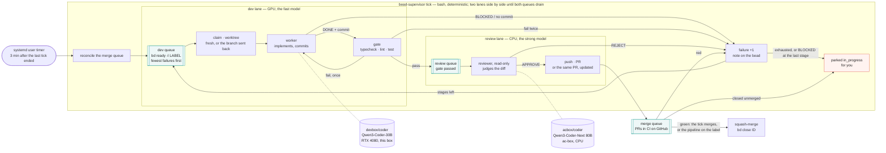

# bead-loop

Work [beads](https://github.com/steveyegge/beads) with local models in any repo: a
supervisor script runs two lanes side by side — a **dev lane** where the implementor
model works a bead in its own worktree and a gate proves it, and a **review lane** where
the reviewer model judges the diff and pushes the PR — over three queues: **dev**,
**review**, **merge** (CI on GitHub). Green merges, the bead closes. A bead sent back
from review or from CI returns to the dev queue with a note and one more **failure**;
enough failures move it to a stronger stage, the last one Claude (Sonnet). No model runs the
loop; models do the two jobs that need judgement, and neither waits for the other.



| Role | What | Where it runs here |
| --- | --- | --- |
| Supervisor | `bin/bead-supervisor`, bash, deterministic | systemd user timer on this box |
| Implementor | opencode agent `bead-worker` | `devbox/coder` — Qwen3-Coder-30B on the RTX 4080; `claude/sonnet` as the last stage |
| Reviewer | opencode agent `bead-reviewer`, read-only | `acbox/coder` — Qwen3-Coder-Next 80B Q8 on ac-box's CPU |

Both models are opencode providers in `~/.config/opencode/opencode.json`; any
`provider/model` works in their place. The fast model implements; the slow, stronger
model gets one call per PR, where it pays.

## What a tick is

A **tick** is one run of `bead-supervisor tick`: a systemd oneshot, no daemon. It
reconciles the merge queue (merge green PRs, close their beads, send red ones back to
dev), then starts the two **lanes** as parallel processes:

- the **dev lane** takes the top of the dev queue, claims it, runs the worker and the
  gate, and puts the bead in the review queue — then takes the next one, as long as the
  dev queue has beads and the merge queue is below `max_inflight`;
- the **review lane** takes the top of the review queue, runs the reviewer, and on
  APPROVE pushes the PR into the merge queue — then takes the next one.

Each lane goes on while its queue has work *or the other lane is busy* (review may send
a bead back to dev; dev is filling review), so the GPU works the next bead while the CPU
reviews the last, and the tick ends only when both queues are drained and both lanes
idle. Then it reconciles once more and exits. The only wait left is CI, and that is why
a timer exists: it fires a new tick 3 minutes after the last one ended
(`OnUnitInactiveSec`), one `gh pr view` per PR in flight. Nothing waits on a clock while
there is work to do. `--once` makes one pass of each lane in turn; `--serial` runs the
lanes one after the other; `lane dev` or `lane review` runs one lane by itself.

A oneshot rather than a daemon because the state is on disk and in `bd`, so a crash or
a `systemctl stop` (which aborts the model sessions the lanes are on) loses nothing but
the rounds in progress, and the next tick reads the world afresh. It also gives
`gpu-mode` one unit to stop and start.

## Layout

```
skills/beads/             bd syntax                        -> ~/.config/opencode/skills/beads
skills/bead-workflow/     one bead, start to finish        -> ~/.config/opencode/skills/bead-workflow
agents/bead-worker.md     implementor agent                -> ~/.config/opencode/agents/
agents/bead-reviewer.md   reviewer agent                   -> ~/.config/opencode/agents/
bin/bead-supervisor       the loop                         -> ~/.local/bin/
bin/bead-loop-ui          the web UI server (node)         -> ~/.local/bin/
ui/index.html             the page it serves
systemd/                  supervisor oneshot + its timer, opencode-web and bead-loop-ui services
bead-loop.example.toml    per-repo config                  -> <repo>/.bead-loop.toml
.flox/env/manifest.toml   flox: every tool above, pinned; bin/ on PATH; services for a box without systemd
docs/loop.mmd             the diagram above
```

`./install.sh` makes the links (re-runnable). The supervisor needs `bd`, `git`, `jq`, `gh`,
`opencode`, `curl` and `yq` (mikefarah, v4: it reads the TOML); the UI needs `node`.
**`flox activate`** in this checkout provides all of them, pinned, plus `bin/` on PATH
(`.flox/env/manifest.toml`), so `bead-supervisor` and `bead-loop-ui` resolve without the
`~/.local/bin` link; on a machine without the systemd units, `flox services start` runs
the same three things (`opencode-web`, `ui`, `loop`). Repo-specific skills (how to verify,
house style, vocabulary) stay in each repo under `.agents/skills/` or
`.opencode/skills/`; the workflow skill tells the worker to look for them.

## Per repo

1. Label the beads the model may work: `bd label add <id> delegate:local`.
   A bead needs a DESCRIPTION naming the files and an ACCEPTANCE CRITERIA the
   worker can run; the workflow skill turns anything vaguer into a `BLOCKED:` note.
2. Copy `bead-loop.example.toml` to `<repo>/.bead-loop.toml`: the label, base branch, `setup`
   (what a fresh worktree needs, e.g. `npm ci`), `gate` (fast local proof),
   `review_model`, `merge`.
3. Add the repo to `repos` in `~/.config/bead-loop/config.toml`. Everything else in
   that file is a default the repo file may override; the models and `[[stages]]`
   usually live there once, not per repo.
4. On GitHub: CI that reports a status on PRs. `gh` must be logged in. By default
   (`merge = "auto"`) the supervisor never asks GitHub to auto-merge: a later tick merges
   once every reported check is green, and refuses while none is reported. Branch
   protection, where the plan allows it, is a second lock.
5. Optional, `merge = "pipeline"`: the loop puts a label on each PR it opens or adopts
   (`merge_label`, default `automerge`) and merging is the pipeline's job — it merges
   the moment its own run is green, no tick in between, and the loop never calls
   `gh pr merge`. The next tick sees `MERGED` and closes the bead. The label must exist in
   the repo; if GitHub refuses it, that is noted on the bead and the PR waits for you.
   (GitHub's own auto-merge is not used: private repos need a paid plan for it.)

## Config

Two TOML files, every key optional. A key in the repo file wins over the same key in
the global one; the global one wins over the default. Anything may go in either.

| Key | Default | What |
| --- | --- | --- |
| `repos` | `[]` | global only: the repos a `tick` walks, `~` allowed |
| `label` | `"delegate:local"` | `bd ready -l LABEL` picks the work; the loop claims, notes and closes beads as this actor, not as you (`BEADS_ACTOR` in its environment overrides) |
| `base` | origin's HEAD | branch to fork from and PR into |
| `setup` | none | runs in a fresh worktree before the worker (`npm ci`); not again on a branch sent back |
| `gate` | none (CI is the gate) | runs after the worker, before the review queue; one fix round on failure |
| `model` | none | the dev lane's worker when no `[[stages]]` table applies |
| `review_model` | none (no review) | the review lane's model when no `[[stages]]` table applies; none: straight to PR |
| `[[stages]]` | one stage of `model`/`review_model`, `failures = 3` | `worker`, `reviewer`, `failures` (1: how many send-backs this stage absorbs before the next takes over; `attempts` still reads), `timeout` (`worker_timeout`), in order |
| `on_exhaust` | `"park"` | after the last stage: `park` for you, or `repeat` the stages |
| `merge` | `"auto"` | `auto`: the tick merges on green · `pipeline`: the loop labels, CI merges · `manual`: PR only |
| `merge_label` | `"automerge"` | the label `pipeline` puts on each PR |
| `adopt` | `true` | open `bead/*` PRs from anyone join the loop |
| `max_inflight` | `1` | PRs in the merge queue before the dev lane pauses; the review lane never waits |
| `worker_timeout` | `3600` | seconds per model session |
| `attach` | none | an opencode server url; sessions run there and stream in its web UI |

`bead-loop.example.toml` is the repo file with every key annotated; `install.sh` seeds
the global one. A file that does not parse stops the run with its name, rather than
silently running with defaults.

## Watching it

**<http://127.0.0.1:4097>** — `bead-loop-ui.service`, one page, pushed every change (an
event stream; nobody presses refresh):

- **Per repo, first and large, the two lanes**: what the **dev lane** is on and what the
  **review lane** is on — id, title, its failure count and stage, the live session's model,
  when it last produced output, a link into it, Abort — or why a lane is idle (queue
  empty; waiting on CI).
- **The three queues in their order**: **dev** (#1 is next; each bead's failures and the
  stage that puts it on), **review** (how long each has waited), **merge** (each PR with
  GitHub's word on it — CI running m/n, red with the failing check, green, merged — asked
  once a minute, so "merged · bead closes on the next tick" shows the moment it merges).
  Then **Needs you** — the human queue: each bead with the question it stopped on (the
  `BLOCKED:` line, the last rejection, the failing check), in full, and the ways out:
  **Answer & resume** (your reply goes on the bead, the bead returns to the dev queue at the
  stage it stopped on with that round forgiven, the next round reads the answer), **Work with
  Claude** (the last stage, now), **Reopen** (as is), or the one-line command that opens an
  interactive Claude Code session in the bead's worktree with the bead and the question as
  the first prompt — you and Claude work it out, commit on the branch, then Answer & resume
  sends it through review and merge. Only when there is one, a session the server is still
  running that is on no lane (an orphan of a killed round, a hand-run `work`), with Abort.
  Idle sessions are history and are not shown; the session link has them.
- **The supervisor's log**, live, and the timer: running or paused, when the next tick is.

The levers, each one command you would otherwise type: **Tick now**, **Stop tick**
(each lane aborts its model session first), **Pause / Resume timer**, **Pause / Resume lane**
(that lane starts no new round; the other goes on — drain review, or hold the CPU box),
**Work with Claude** on any bead (to the last stage and back into the dev queue now, ahead
of its failure count; `bead-supervisor escalate REPO ID`), and **Sign in** in the header when
`claude` is signed out — a banner, since a `claude/*` round cannot run then: such beads wait in
their queue (marked so) rather than burn a failure, and Work with Claude is off. Sign in runs `claude auth login`
for you — open the link it shows, sign in, paste the code back into the page — so the
command centre never needs a terminal for it,
**Abort** on
any busy or orphan session, **Reopen** on a parked bead, and — where the box has a
`gpu-mode` command (this workstation does: `game` stops the loop and the local model
server to free the GPU, `work` starts them again) — a **Work / Game** switch, run as
`sudo -n gpu-mode`, so sudoers must allow it without a password. The server binds to loopback
and refuses cross-site requests; it needs `node`, and `systemctl`/`journalctl` for the
timer and log (without them, those parts say so and the rest works).

Same thing in a terminal:

```bash
bead-supervisor watch                                     # the screen below, every 5 s (BEAD_LOOP_WATCH=N)
bead-supervisor status                                    # the same, once
bead-supervisor --json status                             # one JSON object per repo: what the UI reads
```

```
05:41:12   bead-supervisor watch (every 5s, ctrl-c to stop)

05:39:22 inquire-platform: dev: bead inq-ufz.13 — grading.dlq: 30-day retention (0 failures, worker devbox/coder, reviewer acbox/coder)
05:39:32 inquire-platform: review: inq-85h.5 by acbox/coder (1 failures)
05:40:01 inquire-platform: inq-85h.5: review approved
05:40:03 inquire-platform: opened https://github.com/imkarrer/inquire-platform/pull/44

inquire-platform  label=delegate:local base=master merge=pipeline stages=devbox/coder⇢acbox/coder×3 → acbox/coder⇢acbox/instruct×2 → claude/sonnet⇢claude/sonnet×1
  dev lane:    inq-ufz.13 grading.dlq: 30-day retention as a per-topic config (2m)
  review lane: idle
  dev queue (4):
    1   inq-5rm.11     0× devbox/coder   scripts/*.mjs: replace the never-firing process.on('exit') pg cleanup
    2   inq-8gg.10     1× devbox/coder   packages/domain bands: BAND_CUTS keyed by (rubricVersion, graderModel)
    3   inq-h2i.8      1× devbox/coder   Gate a Claimed Session to its owner
    4   inq-c0t.23     4× acbox/coder    scripts/lib/gate.mjs: Composite spread ratio, tail rank correlation
  review queue (1):
    1   inq-c0t.28     0× devbox/coder   ladderVersion: blind ratings are evidence for the ladder text
  merge queue (1):
    inq-85h.5      https://github.com/imkarrer/inquire-platform/pull/44
  parked: inq-8gg.8
```

The last supervisor log lines, then per repo: what each lane is on, the three queues in
the order the lanes take them (position, id, failures, the stage's worker, title), the
merge queue's PRs, the parked beads — and any session the attached opencode server is
still running that is on no lane, with its state, agent, model, when it last produced
anything, and the web UI url that opens it. Click the url; no need to know how the UI names things (it files
sessions under the worktree's path, base64url-encoded — not under the repo, which is why
the repo's project view looks idle while the loop is busy).

`busy` with a stale "ago" is the slow model thinking: a cold 20k-token prompt is ~2.5
minutes of prefill on the 80B before its first token. **`ORPHAN`** is a session the server calls busy with no `opencode run` client
left on this box: with `attach`, killing the client does not stop the server-side session,
and on a one-model box it starves the next review. The loop aborts its own sessions
on the server when the client dies — on `worker_timeout`, on `systemctl stop`/`restart`
(the TERM handler), and before it recreates a worktree — so an orphan means something
else killed the client (`kill -9`, a crash); the line under it is the command that stops it.

Also:

```bash
journalctl --user -u bead-supervisor.service -f -o cat    # stage transitions, one line each, live
bead-supervisor log ~/src/repo [bead-id]                  # the newest session's log, one line per tool call
```

The web UI itself, <http://127.0.0.1:4096> (`opencode-web.service`): with
`attach = "http://127.0.0.1:4096"` in the global config every worker and reviewer session
runs inside that server and streams there live, titled by bead, with the diff.

State lives in `~/.local/state/bead-loop/<repo>/`: `inflight/<id>` (the PR url),
`logs/<id>.<stamp>.*` (setup, worker, gate, reviewer output per attempt), `wt/<id>`
(the worktree while a bead is on a lane or waiting for review), `review/<id>` (the review
queue: the worker's last words), `failures/<id>` (+ `.notes`, the history), `lane.dev` /
`lane.review` (the bead each lane is on).

## Run

```bash
bead-supervisor --dry-run work ~/src/repo               # the bead the dev lane would take, and its prompt
bead-supervisor --local work ~/src/repo inq-abc.1       # implement, gate, review; no push
bead-supervisor work ~/src/repo                         # one bead through both lanes, to a PR
bead-supervisor lane dev                                # one lane by itself, until its queue is empty
bead-supervisor pause review                            # that lane starts no new round until resume
bead-supervisor answer ~/src/repo inq-abc.1 "use --dry-run"   # reply to a bead in the human queue; back to dev
bead-supervisor open ~/src/repo inq-abc.1               # you + Claude Code in the bead's worktree, question in hand
bead-supervisor tick                                    # what the timer does: both lanes, side by side
systemctl --user start --no-block bead-supervisor.service   # a tick now, in the background (a tick runs as long as there is work)
systemctl --user enable --now opencode-web.service bead-loop-ui.service bead-supervisor.timer
sudo loginctl enable-linger $USER                       # timers survive logout
```

## Lifecycle of one bead

A **round** is one pass through the two lanes: worker → gate (one fix round on failure)
→ reviewer → PR. Three things end a round early and send the bead **back to the dev
queue**, each with a note on the bead saying exactly what happened and **one more
failure** on its count:

- the dev lane itself: the worker says `BLOCKED:`, makes no commit, or the gate fails
  twice — the branch is removed and the next round starts fresh;
- the review lane: `REJECT:` — the branch and its worktree are *kept*; the next round's
  worker is told to fix its commit in place, and the reviewer sees the fix on top;
- the merge queue: CI red — same branch, kept; the next round's push updates the same PR.

The failure count is what chooses the **stage**, the `[[stages]]` tables in the config:

```toml
on_exhaust = "repeat"

[[stages]]
worker = "devbox/coder"
reviewer = "acbox/coder"
failures = 3

[[stages]]
worker = "acbox/coder"
reviewer = "acbox/instruct"
failures = 2
timeout = 14400

[[stages]]
worker = "claude/sonnet"
reviewer = "claude/sonnet"
failures = 1
```

Read: a bead starts on the fast GPU worker reviewed by the 80B and stays there for its
first three failures; the fourth and fifth send it to the 80B implementing with the
*other* 80B reviewing (four-hour timeout); the sixth to Claude; then, with `repeat`,
around again until it lands. So "when does something get evicted to Claude" is one
number: the sum of `failures` above the Claude stage. A stage may name `claude/<alias>`
(`claude/sonnet`, `claude/opus`): that round runs in Claude Code (`claude -p`) instead
of opencode, the agent file's body as its system prompt, tools by role — the frontier
model gets only what the local ones could not land. It needs `claude` on PATH and logged
in once (`claude`, then `/login`); the skills are linked into `~/.claude/skills` by
`install.sh`. (`attempts` is the older name for `failures` and still reads.)

Both queues are ordered **fewest failures first**, then bd's own order: everything is
tried once before anything is tried twice, and a bead that keeps failing gets out of the
way of the ones that do not. The next round's worker reads the notes of the earlier ones.

Three things put a bead in the **human queue** (`in_progress`, no more rounds until you act): the stages are
exhausted with `on_exhaust = "park"`, or the *last* stage says `BLOCKED:` — a claim in the
bead is false, or a decision is yours — and a PR closed unmerged. The UI shows the question and
takes the answer; `bead-supervisor answer` and `open` are the same from a terminal.

## PRs from anyone

`reconcile` also **adopts** any open PR on a `bead/<id>…` branch it did not open — another
session's, or yours by hand. It treats it like its own: merged on green under `auto`,
labelled for the pipeline under `pipeline`, and the bead the branch names closes. Adopted PRs cost CI, not the model, so they do not count toward
`max_inflight`. `adopt = false` turns it off.

## What each outcome does to the bead

| Outcome | Bead | Branch / PR |
| --- | --- | --- |
| Worker `BLOCKED:` | note with the worker's line, +1 failure; dev queue, parked if this was the last stage | removed |
| Setup fails, or no commit | note with the tail of the log, +1 failure; dev queue | removed |
| Gate fails twice (one fix round with its output) | note with the errors, +1 failure; dev queue | removed |
| Gate passes | in_progress; review queue | kept, in its worktree |
| Reviewer `REJECT:` | note with the rejection, +1 failure; dev queue — the worker fixes in place | kept |
| Reviewer `APPROVE:` | in_progress, comment with the url; merge queue | pushed; PR opened, or the existing one updated |
| CI green, `merge = "auto"` | closed with the PR url | squash-merged by the tick, branch deleted |
| CI green, `merge = "pipeline"` | closed once the pipeline has merged | labelled `automerge` at open; the pipeline merges |
| CI green, `merge = "manual"` | in_progress | PR left open for you |
| CI red | note with the failing checks, +1 failure; dev queue | kept; the next round's push updates the PR |
| CI red on an adopted PR | in_progress, one note | left open for whoever opened it |
| Failures exhausted (`on_exhaust = "park"`) | in_progress, for you | removed |
| PR closed unmerged | in_progress, note | gone |

`in_progress` covers every state past the dev queue — on a lane, waiting for review, in
CI, parked — and `bd ready` never hands it out again; `bd show` says why. Reopen a parked
bead with `bd update <id> --status open` (or the UI's Reopen) once the bead or the code
is fixed.

The worker never runs `bd`; the bead's text is in its prompt and the supervisor
records every state change in the operator's checkout. `.beads/issues.jsonl` changes
there, uncommitted, for you to commit with your own work.

## Dogfood

This repo is one of the loop's repos: `.beads/` holds its backlog (`bd ready -l
delegate:local` lists what the loop may take), `.bead-loop.toml` says how a worktree is
proven (the same syntax, shellcheck, skills lint and state-machine suite CI runs), and
`~/src/bead-loop` is in the global `repos`. So an improvement to the loop is a bead, and
the loop works it: worker, gate, reviewer, PR, CI, merge. The timer runs this checkout,
so a merged bead changes the running loop on its next tick — the gate, CI and the merge
are the guard, and a bead that touches `bin/bead-supervisor`'s core should say so in its
acceptance criteria. The Rust rewrite (`bd show bl-ect`) is an epic of six beads kept out
of the queue (no label) until the loop has proven itself on smaller ones.

## Checks

`test/run.sh` drives the supervisor through every row of the outcome table above with
stub `bd`, `opencode` and `gh` (`test/bin/`) and a real git origin: no model, no network,
a few seconds. `test/lint-skills.sh` checks the frontmatter opencode needs. Both run with
shellcheck in `.github/workflows/ci.yml` on every push and PR, and `main` requires that
check green. The same checks run on Buildkite (`.buildkite/pipeline.yml`, queue `self`),
every step inside this repo's `.flox/` through the imkarrer/flox plugin.

## Why this shape

- Two model servers on two boxes, so two lanes: the GPU implements the next bead while
  the CPU reviews the last, and each lane has one bead at a time. One PR in CI at a time by
  default (`max_inflight`), because CI on a shared queue is the other scarce thing.
- The 80B generates at 10–12 tok/s on its own and prefills at ~140 tok/s (measured from
  the review logs' step timestamps, 19 Sep 2026; agent-hub's docs/prefill-tuning.md has
  the box-side numbers): a fresh 20k-token diff is ~2.5 minutes before the first token,
  and every agentic turn would pay that again. Too slow to sit in an edit loop, too good
  to leave out; one review call per round is where it pays, and the server's prompt cache
  makes each later turn of that one call a 10 ms prefix load. It halves when something
  else is on the same backend — `coder` runs two slots since 18 Sep, and the `instruct`
  model shares the cores — which is what a "3 tok/s" reading is. First live result: it
  rejected a diff the 30B had declared done, for duplicating entries that already existed.
- A send-back is a failure, wherever it comes from — the gate, the reviewer, CI — and the
  failure count alone picks the stage. One counter, one table, no special cases.
- Every claim is checked by something that is not the model that made it: the gate,
  the reviewer, CI, and the merge check are independent refusals.
- `run_agent` in `bin/bead-supervisor` is the one seam to the harness: opencode for local
  models, Claude Code for `claude/*`; adding aider would be one more case there.
