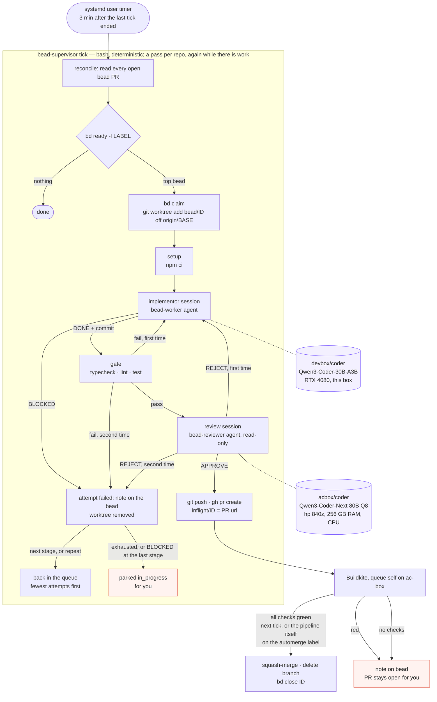

# bead-loop

Work [beads](https://github.com/steveyegge/beads) with local models in any repo: a
supervisor script picks a labelled bead, an implementor model works it in a fresh
worktree, a gate proves it, a reviewer model judges the diff, a PR goes up, CI runs,
green merges, the bead closes. No model runs the loop; models do the two jobs that
need judgement.



| Role | What | Where it runs here |
| --- | --- | --- |
| Supervisor | `bin/bead-supervisor`, bash, deterministic | systemd user timer on this box |
| Implementor | opencode agent `bead-worker` | `devbox/coder` — Qwen3-Coder-30B on the RTX 4080; `claude/opus` as the last stage |
| Reviewer | opencode agent `bead-reviewer`, read-only | `acbox/coder` — Qwen3-Coder-Next 80B Q8 on ac-box's CPU |

Both models are opencode providers in `~/.config/opencode/opencode.json`; any
`provider/model` works in their place. The fast model implements; the slow, stronger
model gets one call per PR, where it pays.

## What a tick is

A **tick** is one run of `bead-supervisor tick`: a systemd oneshot, no daemon. It makes
**passes** over the repos — reconcile the open PRs, then attempt one bead — and goes
round again as long as a pass attempted something, so bead follows bead with the model
never idle. The pass that finds nothing to attempt ends the tick: nothing ready, or
`max_inflight` PRs waiting on CI. That wait is the only reason a timer exists: it fires
a new tick 3 minutes after the last one ended (`OnUnitInactiveSec`), and each such tick
is one `gh pr view` per PR in flight, a second of work. Nothing in the loop waits on a
clock while there is work to do. `--once` makes a single pass, for a hand-run check.

A oneshot rather than a daemon because the state is on disk and in `bd`, so a crash
or a `systemctl stop` (which aborts the model session the tick is on) loses nothing
but the attempt in progress, and the next tick reads the world afresh. It also gives
`gpu-mode` one unit to stop and start.

## Layout

```
skills/beads/             bd syntax                        -> ~/.config/opencode/skills/beads
skills/bead-workflow/     one bead, start to finish        -> ~/.config/opencode/skills/bead-workflow
agents/bead-worker.md     implementor agent                -> ~/.config/opencode/agents/
agents/bead-reviewer.md   reviewer agent                   -> ~/.config/opencode/agents/
bin/bead-supervisor       the loop                         -> ~/.local/bin/
bin/bead-loop-ui          the web UI server (node)         -> ~/.local/bin/
ui/index.html             the page it serves
systemd/                  supervisor oneshot + its timer, opencode-web and bead-loop-ui services
bead-loop.example.toml    per-repo config                  -> <repo>/.bead-loop.toml
.flox/env/manifest.toml   flox: every tool above, pinned; bin/ on PATH; services for a box without systemd
docs/loop.mmd             the diagram above
```

`./install.sh` makes the links (re-runnable). The supervisor needs `bd`, `git`, `jq`, `gh`,
`opencode`, `curl` and `yq` (mikefarah, v4: it reads the TOML); the UI needs `node`.
**`flox activate`** in this checkout provides all of them, pinned, plus `bin/` on PATH
(`.flox/env/manifest.toml`), so `bead-supervisor` and `bead-loop-ui` resolve without the
`~/.local/bin` link; on a machine without the systemd units, `flox services start` runs
the same three things (`opencode-web`, `ui`, `loop`). Repo-specific skills (how to verify,
house style, vocabulary) stay in each repo under `.agents/skills/` or
`.opencode/skills/`; the workflow skill tells the worker to look for them.

## Per repo

1. Label the beads the model may work: `bd label add <id> delegate:local`.
   A bead needs a DESCRIPTION naming the files and an ACCEPTANCE CRITERIA the
   worker can run; the workflow skill turns anything vaguer into a `BLOCKED:` note.
2. Copy `bead-loop.example.toml` to `<repo>/.bead-loop.toml`: the label, base branch, `setup`
   (what a fresh worktree needs, e.g. `npm ci`), `gate` (fast local proof),
   `review_model`, `merge`.
3. Add the repo to `repos` in `~/.config/bead-loop/config.toml`. Everything else in
   that file is a default the repo file may override; the models and `[[stages]]`
   usually live there once, not per repo.
4. On GitHub: CI that reports a status on PRs. `gh` must be logged in. By default
   (`merge = "auto"`) the supervisor never asks GitHub to auto-merge: a later tick merges
   once every reported check is green, and refuses while none is reported. Branch
   protection, where the plan allows it, is a second lock.
5. Optional, `merge = "pipeline"`: the loop puts a label on each PR it opens or adopts
   (`merge_label`, default `automerge`) and merging is the pipeline's job — it merges
   the moment its own run is green, no tick in between, and the loop never calls
   `gh pr merge`. The next tick sees `MERGED` and closes the bead. The label must exist in
   the repo; if GitHub refuses it, that is noted on the bead and the PR waits for you.
   (GitHub's own auto-merge is not used: private repos need a paid plan for it.)

## Config

Two TOML files, every key optional. A key in the repo file wins over the same key in
the global one; the global one wins over the default. Anything may go in either.

| Key | Default | What |
| --- | --- | --- |
| `repos` | `[]` | global only: the repos a `tick` walks, `~` allowed |
| `label` | `"delegate:local"` | `bd ready -l LABEL` picks the work; the loop claims, notes and closes beads as this actor, not as you (`BEADS_ACTOR` in its environment overrides) |
| `base` | origin's HEAD | branch to fork from and PR into |
| `setup` | none | runs in the fresh worktree before the worker (`npm ci`) |
| `gate` | none (CI is the gate) | runs after the worker, before any push; one revision round on failure |
| `model` | none | the worker when no `[[stages]]` table applies |
| `review_model` | none (no review) | the senior model that judges the diff before the push |
| `[[stages]]` | one attempt with `model`/`review_model` | `worker`, `reviewer`, `attempts` (1), `timeout` (`worker_timeout`), in order |
| `on_exhaust` | `"park"` | after the last stage: `park` for you, or `repeat` the stages |
| `merge` | `"auto"` | `auto`: the tick merges on green · `pipeline`: the loop labels, CI merges · `manual`: PR only |
| `merge_label` | `"automerge"` | the label `pipeline` puts on each PR |
| `adopt` | `true` | open `bead/*` PRs from anyone join the loop |
| `max_inflight` | `1` | open PRs per repo before the loop waits for CI |
| `worker_timeout` | `3600` | seconds per model session |
| `attach` | none | an opencode server url; sessions run there and stream in its web UI |

`bead-loop.example.toml` is the repo file with every key annotated; `install.sh` seeds
the global one. A file that does not parse stops the run with its name, rather than
silently running with defaults.

## Watching it

**<http://127.0.0.1:4097>** — `bead-loop-ui.service`, one page, pushed every change (an
event stream; nobody presses refresh):

- **Per repo, first and large**: **which bead this tick is on** — id, title, attempt, the stage
  running as a role chip (worker or reviewer) with its model, when it last produced output,
  a link into the live session, Abort. Under it the counts: beads ready, PRs in
  flight and whether CI is red, how many are parked. A PR's state is GitHub's, asked once
  a minute — "merged · bead closes on the next tick" the moment it merges, even while a
  long attempt keeps the loop from reconciling.
- **Per repo**: the ready queue with each bead's attempt count, the parked beads, the PRs in
  flight — and, only when there is one, a session the server is still running that is *not*
  the bead being worked (an orphan of a killed attempt, a hand-run `work`), with its Abort.
  Idle sessions are history and are not shown; the session link has them.
- **The supervisor's log**, live, and the timer: running or paused, when the next tick is.

The levers, each one command you would otherwise type: **Tick now**, **Stop tick**
(the supervisor aborts its model session first), **Pause / Resume timer**, **Abort** on
any busy or orphan session, **Reopen** on a parked bead, and — where the box has a
`gpu-mode` command (this workstation does: `game` stops the loop and the local model
server to free the GPU, `work` starts them again) — a **Work / Game** switch, run as
`sudo -n gpu-mode`, so sudoers must allow it without a password. The server binds to loopback
and refuses cross-site requests; it needs `node`, and `systemctl`/`journalctl` for the
timer and log (without them, those parts say so and the rest works).

Same thing in a terminal:

```bash
bead-supervisor watch                                     # the screen below, every 5 s (BEAD_LOOP_WATCH=N)
bead-supervisor status                                    # the same, once
bead-supervisor --json status                             # one JSON object per repo: what the UI reads
```

```
03:23:33   bead-supervisor watch (every 5s, ctrl-c to stop)

03:02:00 inquire-platform: inq-c0t.23: review by acbox/coder
03:16:22 inquire-platform: inq-c0t.23: review rejected, revision round
03:19:21 inquire-platform: inq-c0t.23 attempt 2 stopped: gate failed after revision: npm run typecheck && ...

inquire-platform  label=delegate:local base=master merge=pipeline stages=3  first: worker=devbox/coder reviewer=acbox/coder
  ready: inq-c0t.29 inq-c0t.28 inq-c0t.23
  wt/inq-c0t.25  attempt 1
    ORPHAN  bead-reviewer  acbox/coder         78s ago  Grader version implementation from model server   http://127.0.0.1:4096/L2hvbWUv…/session/ses_f487b4f08ffe…
            no client on this box; stop it:  curl -X POST http://127.0.0.1:4096/session/ses_f487b4f08ffe…/abort
    idle    bead-worker    devbox/coder        48m ago  Services/grader stamps graderVersion from model   http://127.0.0.1:4096/L2hvbWUv…/session/ses_f4887c37dffe…
```

The last supervisor log lines, then per repo: PRs in flight, ready beads, parked beads, and every
worktree under `wt/` with what the attached opencode server has for it — newest sessions
first, each with its state, agent, model, when it last produced anything, and the web UI
url that opens it. Click the url; no need to know how the UI names things (it files
sessions under the worktree's path, base64url-encoded — not under the repo, which is why
the repo's project view looks idle while the loop is busy).

`busy` with a stale "ago" is the slow model thinking: the 80B takes minutes before its
first token. **`ORPHAN`** is a session the server calls busy with no `opencode run` client
left on this box: with `attach`, killing the client does not stop the server-side session,
and on a one-model box it starves the next review. The loop aborts its own sessions
on the server when the client dies — on `worker_timeout`, on `systemctl stop`/`restart`
(the TERM handler), and before it recreates a worktree — so an orphan means something
else killed the client (`kill -9`, a crash); the line under it is the command that stops it.

Also:

```bash
journalctl --user -u bead-supervisor.service -f -o cat    # stage transitions, one line each, live
bead-supervisor log ~/src/repo [bead-id]                  # the newest session's log, one line per tool call
```

The web UI itself, <http://127.0.0.1:4096> (`opencode-web.service`): with
`attach = "http://127.0.0.1:4096"` in the global config every worker and reviewer session
runs inside that server and streams there live, titled by bead, with the diff.

State lives in `~/.local/state/bead-loop/<repo>/`: `inflight/<id>` (the PR url),
`logs/<id>.<stamp>.*` (setup, worker, gate, reviewer output per attempt), `wt/<id>`
(the worktree while a bead is in progress), `attempts/<id>`.

## Run

```bash
bead-supervisor --dry-run work ~/src/repo               # the bead and prompt it would use
bead-supervisor --local work ~/src/repo inq-abc.1       # implement, gate, review; no push
bead-supervisor work ~/src/repo                         # one bead through to a PR
bead-supervisor tick                                    # what the timer does
systemctl --user enable --now opencode-web.service bead-loop-ui.service bead-supervisor.timer
sudo loginctl enable-linger $USER                       # timers survive logout
```

## Lifecycle of one bead

An **attempt** is worker → gate (one fix round on failure) → reviewer (one fix round on
REJECT). It ends in a PR, or in a note on the bead saying exactly where it stopped.

What happens after a failed attempt is the **escalation path**, the `[[stages]]` tables in the config:

```toml
on_exhaust = "repeat"

[[stages]]
worker = "devbox/coder"
reviewer = "acbox/coder"
attempts = 3

[[stages]]
worker = "acbox/coder"
reviewer = "acbox/instruct"
attempts = 2
timeout = 14400
```

Read: three attempts with the fast GPU worker reviewed by the 80B; then two with the 80B
implementing and the *other* 80B reviewing (four-hour timeout); then, with `repeat`,
around again until it lands. A stage may name `claude/<alias>` (`claude/opus`,
`claude/sonnet`): that attempt runs in Claude Code (`claude -p`) instead of opencode, the
agent file's body as its system prompt, tools by role — the frontier model gets only
what the local ones could not land. It needs `claude` on PATH and logged in once
(`claude`, then `/login`); the skills are linked into `~/.claude/skills` by `install.sh`. A failed attempt puts the bead back in the queue with its
note; the next attempt reads the notes of the earlier ones. Among ready beads the one
with the fewest attempts goes first, so a stubborn bead never starves the rest.

Two things park a bead (`in_progress`, no more attempts) for a human: the stages are
exhausted with `on_exhaust = "park"`, or the *last* stage says `BLOCKED:` — a claim in the
bead is false, and no model fixes that.

## PRs from anyone

`reconcile` also **adopts** any open PR on a `bead/<id>…` branch it did not open — another
session's, or yours by hand. It treats it like its own: merged on green under `auto`,
labelled for the pipeline under `pipeline`, and the bead the branch names closes. Adopted PRs cost CI, not the model, so they do not count toward
`max_inflight`. `adopt = false` turns it off.

## What each outcome does to the bead

| Outcome | Bead | Branch / PR |
| --- | --- | --- |
| Worker `BLOCKED:` | note with the worker's line; back in the queue for the next stage, parked if this was the last | removed |
| Setup fails, or no commit | note with the tail of the log; next attempt | removed |
| Gate fails twice (one revision round with its output) | note with the errors; next attempt | removed |
| Reviewer `REJECT:` twice | note with the last rejection; next attempt | removed |
| Attempts exhausted (`on_exhaust = "park"`) | in_progress, for you | — |
| PR opened | in_progress, comment with the url | pushed |
| CI green, `merge = "auto"` | closed with the PR url | squash-merged by the tick, branch deleted |
| CI green, `merge = "pipeline"` | closed once the pipeline has merged | labelled `automerge` at open; the pipeline merges |
| CI green, `merge = "manual"` | in_progress | PR left open for you |
| CI red | in_progress, one note | PR left open for you |
| PR closed unmerged | in_progress, note | gone |

`in_progress` is the parking state: `bd ready` never hands it out again, and `bd show`
says why. Reopen with `bd update <id> --status open` once the bead or the code is fixed.

The worker never runs `bd`; the bead's text is in its prompt and the supervisor
records every state change in the operator's checkout. `.beads/issues.jsonl` changes
there, uncommitted, for you to commit with your own work.

## Checks

`test/run.sh` drives the supervisor through every row of the outcome table above with
stub `bd`, `opencode` and `gh` (`test/bin/`) and a real git origin: no model, no network,
a few seconds. `test/lint-skills.sh` checks the frontmatter opencode needs. Both run with
shellcheck in `.github/workflows/ci.yml` on every push and PR, and `main` requires that
check green.

## Why this shape

- One model server per box, so one bead in flight per box: `max_inflight` defaults to 1
  and a lock keeps ticks from overlapping.
- The 80B at ~3 tok/s is too slow to sit in an agentic edit loop and too good to leave
  out; one review call per PR is where it pays. First live result: it rejected a diff
  the 30B had declared done, for duplicating entries that already existed.
- Every claim is checked by something that is not the model that made it: the gate,
  the reviewer, CI, and the merge check are independent refusals.
- `run_agent` in `bin/bead-supervisor` is the one seam to the harness: opencode for local
  models, Claude Code for `claude/*`; adding aider would be one more case there.
