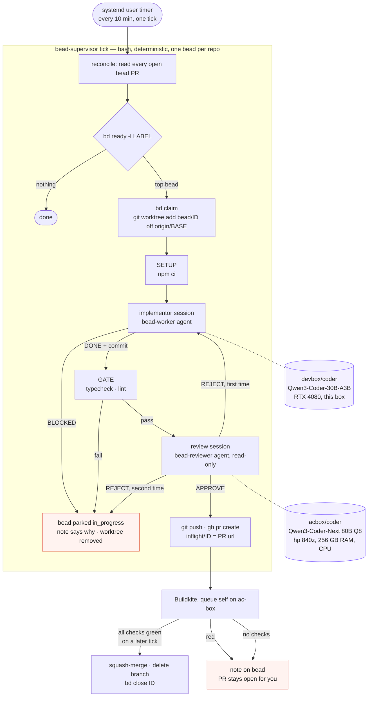

| PR opened | in_progress, comment with the url | pushed; nothing merges until a later tick sees every check green |
# bead-loop

Work [beads](https://github.com/steveyegge/beads) with local models in any repo: a
supervisor script picks a labelled bead, an implementor model works it in a fresh
worktree, a gate proves it, a reviewer model judges the diff, a PR goes up, CI runs,
green merges, the bead closes. No model runs the loop; models do the two jobs that
need judgement.



| Role | What | Where it runs here |
| --- | --- | --- |
| Supervisor | `bin/bead-supervisor`, bash, deterministic | systemd user timer on this box |
| Implementor | opencode agent `bead-worker` | `devbox/coder` — Qwen3-Coder-30B on the RTX 4080 |
| Reviewer | opencode agent `bead-reviewer`, read-only | `acbox/coder` — Qwen3-Coder-Next 80B Q8 on ac-box's CPU |

Both models are opencode providers in `~/.config/opencode/opencode.json`; any
`provider/model` works in their place. The fast model implements; the slow, stronger
model gets one call per PR, where it pays.

## Layout

```
skills/beads/             bd syntax                        -> ~/.config/opencode/skills/beads
skills/bead-workflow/     one bead, start to finish        -> ~/.config/opencode/skills/bead-workflow
agents/bead-worker.md     implementor agent                -> ~/.config/opencode/agents/
agents/bead-reviewer.md   reviewer agent                   -> ~/.config/opencode/agents/
bin/bead-supervisor       the loop                         -> ~/.local/bin/
systemd/                  supervisor oneshot + 10 min timer, opencode-web service
bead-loop.example         per-repo config                  -> <repo>/.bead-loop
docs/loop.mmd             the diagram above
```

`./install.sh` makes the links (re-runnable). Repo-specific skills (how to verify,
house style, vocabulary) stay in each repo under `.agents/skills/` or
`.opencode/skills/`; the workflow skill tells the worker to look for them.

## Per repo

1. Label the beads the model may work: `bd label add <id> delegate:local`.
   A bead needs a DESCRIPTION naming the files and an ACCEPTANCE CRITERIA the
   worker can run; the workflow skill turns anything vaguer into a `BLOCKED:` note.
2. Copy `bead-loop.example` to `<repo>/.bead-loop`: the label, base branch, `SETUP`
   (what a fresh worktree needs, e.g. `npm ci`), `GATE` (fast local proof),
   `REVIEW_MODEL`, `MERGE`.
3. Add the repo to `REPOS` in `~/.config/bead-loop/config`.
4. On GitHub: CI that reports a status on PRs. `gh` must be logged in. The supervisor
   never asks GitHub to auto-merge (on a branch with no required checks that merges
   immediately); a later tick merges once every reported check is green, and refuses
   while none is reported. Branch protection, where the plan allows it, is a second lock.

## Watching it

Interactive: `opencode-web.service` serves opencode's web UI at
<http://127.0.0.1:4096>. With `ATTACH=http://127.0.0.1:4096` in the global config
every worker and reviewer session runs inside that server, so it streams there live,
titled by bead, with the diff. No terminal needed. The UI starts empty per browser: **Add
project** → select the repo (e.g. `~/src/inquire-platform`); its bead sessions, run in
worktrees, file under it. Once per browser per repo.

From a terminal:

```bash
journalctl --user -u bead-supervisor.service -f -o cat    # stage transitions, one line each
bead-supervisor status                                    # ready beads, PRs in flight, CI red
bead-supervisor log ~/src/repo [bead-id]                  # the newest session, one line per tool call
```

State lives in `~/.local/state/bead-loop/<repo>/`: `inflight/<id>` (the PR url),
`logs/<id>.<stamp>.*` (setup, worker, gate, reviewer output per attempt), `wt/<id>`
(the worktree while a bead is in progress).

## Run

```bash
bead-supervisor --dry-run work ~/src/repo               # the bead and prompt it would use
bead-supervisor --local work ~/src/repo inq-abc.1       # implement, gate, review; no push
bead-supervisor work ~/src/repo                         # one bead through to a PR
bead-supervisor tick                                    # what the timer does
systemctl --user enable --now opencode-web.service bead-supervisor.timer
sudo loginctl enable-linger $USER                       # timers survive logout
```

## What each outcome does to the bead

| Outcome | Bead | Branch / PR |
| --- | --- | --- |
| Worker `BLOCKED:` | in_progress, note with the worker's line | removed |
| Setup, gate or no commit | in_progress, note with the tail of the log | removed |
| Reviewer `REJECT:` twice | in_progress, note with the last rejection | removed |
| PR opened | in_progress, comment with the url | pushed |
| CI green | closed with the PR url | squash-merged, branch deleted |
| CI red | in_progress, one note | PR left open for you |
| PR closed unmerged | in_progress, note | gone |

`in_progress` is the parking state: `bd ready` never hands it out again, and `bd show`
says why. Reopen with `bd update <id> --status open` once the bead or the code is fixed.

The worker never runs `bd`; the bead's text is in its prompt and the supervisor
records every state change in the operator's checkout. `.beads/issues.jsonl` changes
there, uncommitted, for you to commit with your own work.

## Why this shape

- One model server per box, so one bead in flight per box: `MAX_INFLIGHT` defaults to 1
  and the timer serialises ticks with a lock.
- The 80B at ~3 tok/s is too slow to sit in an agentic edit loop and too good to leave
  out; one review call per PR is where it pays. First live result: it rejected a diff
  the 30B had declared done, for duplicating entries that already existed.
- Every claim is checked by something that is not the model that made it: the gate,
  the reviewer, CI, and the merge check are independent refusals.
- `run_agent` in `bin/bead-supervisor` is the one seam to the harness: swapping the
  implementor for aider, or either model for another, is that one function.
