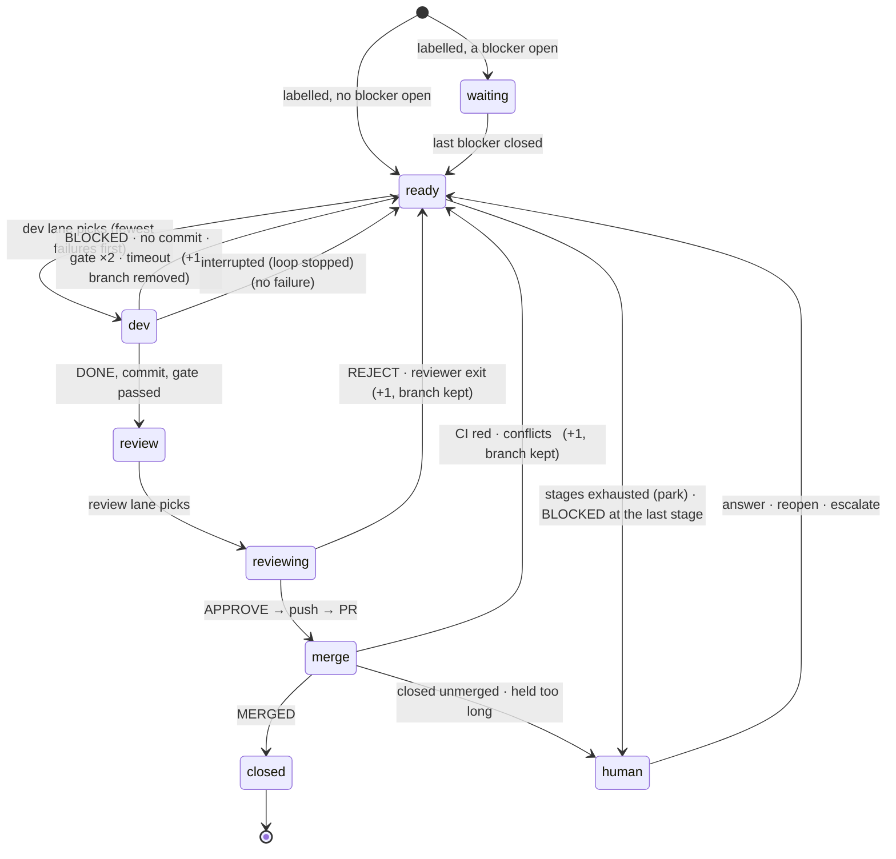

# The bead state machine: every state, every exit

Status: specification, for the resident loop ([design-resident-loop.md](design-resident-loop.md)).
Written 2026-09-20 from `bin/bead-supervisor` as it is, not from the README. Each
transition says whether it exists today. The rule the whole thing serves:

> **A bead is always in exactly one place, and every place has an exit that is either
> automatic or a human's, and every wait has a timeout that re-reads the world.**

A state with no exit is a deadlock. A wait with no timeout is a deadlock waiting for a
lost signal. An infrastructure failure counted as a bead failure is a livelock: the
queue burns through its stages while nothing is wrong with the beads.

## What the state is made of

The loop keeps no state of its own beyond files; a bead's state is a function of:

| where | what |
| --- | --- |
| bd | `status` (`open` / `in_progress` / `closed`; `blocked`, `deferred` by hand), the label, blockers (`bd ready` lists only beads with none open), notes |
| `$RS/failures/ID` | the failure count → the stage (`stage_for`); `.notes` the history |
| `$RS/review/ID` | in the review queue (holds the worker's last line) |
| `$RS/inflight/ID` | in the merge queue (holds the PR url); beside it `.ID.adopted`, `.ID.red`, `.ID.nocheck`, `.ID.fixing` |
| `$RS/lane.NAME` | the bead the lane NAME is on (`dev`, `review`; or the `[[lanes]]` names: `gpu`, `cpu`, `claude`) |
| `$RS/rejoin/ID` | `SID worker` or `SID reviewer`: a session still running on the server after a restart, for the lane to wait on instead of starting one |
| `$RS/wt/ID`, branch `bead/ID` (local, origin) | the work |
| GitHub | the PR: none / OPEN (checks pending, green, red, none; mergeState CLEAN, BEHIND, DIRTY, BLOCKED) / MERGED / CLOSED |
| the servers | opencode session running or orphaned; devbox, acbox, claude, gh reachable or not |

## The states

| state | on disk | who exits it |
| --- | --- | --- |
| **waiting** | bd `open` + label, a blocker not `closed` | bd, when the blocker closes (a merge, or a human) |
| **ready** | bd `open` + label, no blocker open; none of the markers below | the dev lane |
| **dev** | `lane.NAME = ID` (the lane on it), bd `in_progress`, `wt/ID` | the dev lane: to review, or back to ready |
| **review** | `review/ID`, `wt/ID`, bd `in_progress` | the review lane |
| **reviewing** | `review/ID` + `lane.NAME = ID` | the review lane: to merge, or back to ready |
| **merge** | `inflight/ID` + PR OPEN, bd `in_progress` | the merge watcher: closed, or back to ready, or human |
| **human** | bd `in_progress`, no marker, no worktree (*parked*), `parked/ID` when the loop parked it — or any queue state with a `held` flag (below) | you: answer, reopen, escalate, or the merge queue's own recovery |
| **closed** | bd `closed` | terminal |

Two flags are orthogonal to the state and do not move a bead:

- `.ID.adopted` — a PR the loop did not open; it never sends back, it only closes.
- **`held/ID`** (new) — the bead is in its queue but something outside the loop must
  change before it moves: the note says what. Shown in the human queue *beside* parked
  beads, and still polled, so it clears itself when the world changes. Held is how the
  loop says "I am waiting on you" without abandoning the bead.
- **`parked/ID`** — the loop's record of a parking: the reason (BLOCKED at the last
  stage, stages exhausted, the PR closed), the stage it stopped on, and **the question**
  for the owner — the brief's (`brief_model` reads the rounds and their logs and answers
  what happened, why, what to decide) or the loop's own from the reason. Written on every
  exit into *human (parked)*, removed by `answer`, `escalate` and the next claim. A bead
  `in_progress` with no record was parked by hand or by a stop. Beside it,
  `failures/ID.rounds.jsonl` is the history the page and the brief read: one record per
  send-back with the whole note and the round's log files.

## Invariants

1. **One place.** `ready ∩ review ∩ merge ∩ lane = ∅`. Today this holds only through
   bd status: a bead in review or merge is `in_progress`, so `bd ready` omits it. It
   breaks the moment a human — or `answer`, or `escalate` — sets it `open` while
   `review/ID` or `inflight/ID` exists: the dev lane and the review lane take the same
   bead, and `dev_one` aborts the reviewer's session and rebuilds the worktree under it.
   **Fix:** `dev_queue` filters out any id in `review/`, `inflight/` or on a lane;
   `answer`/`escalate`/reopen refuse (with the reason) on a bead in the merge queue.
2. **Every wait times out and re-reads the world.** Lanes block on the bell with a 60 s
   heartbeat; the merge watcher polls; no `sleep` without a bound. A lost wake costs at
   most one heartbeat.
3. **Infrastructure is never a bead failure.** Only the model's own outcome counts:
   `BLOCKED:`, no commit, the gate failing twice, the session timing out, `REJECT:`, CI
   red, conflicts. Setup failing, a model server unreachable, `bd`/`git`/`gh` erroring,
   Claude or gh signed out: the round did not happen. The bead stays where it is, held,
   and the lane backs off. **Today every one of these is `send_back +1`** (setup,
   worker/reviewer non-zero exit) **or kills the lane** (`set -e` on a `bd`/`git` error).
   With the 30B down, today's loop would send every ready bead back, one stage each,
   in minutes.
4. **A crash in a round is contained.** Each round runs in a subshell with its own error
   trap: the lane records "round crashed: <last command>" on the bead, holds it, and
   goes on to the next. Three crashes on one bead → parked. Today a crash kills the lane
   (a tick: the other lane finishes; a resident loop: that lane is dead until restart).
5. **Start is a recovery.** The loop's first act: clear `lane.*`, abort any session under
   any `wt/`, reopen interrupted dev rounds (bd `in_progress` + `wt/ID` + no `review/`
   + no `inflight/` = a round the stop cut short — no failure, "round interrupted"),
   re-probe claude/gh/servers, drop `held/` flags whose reason no longer holds.
   Today an interrupted dev round looks parked (Needs you, Reopen) — the human recovers
   what the loop could.
6. **A dead lane is restarted.** The parent watches its lane subshells; one that exits
   is logged and started again after a backoff. A lane cannot be quietly gone.

## Transitions, one per line

**exists** = built today; **fix** = built but wrong; **new** = to build.

### ready → dev → …

| from | event | to | count | branch | status |
| --- | --- | --- | --- | --- | --- |
| ready | dev lane picks, stage found | dev | — | fresh from `origin/BASE`, or the kept branch resumed | exists |
| ready | dev lane picks, stages exhausted (`park`) | human | — | — | exists |
| ready | stage's worker is `claude/*`, signed out | ready (held: "Claude signed out") | — | — | exists as a skip; **fix**: probed once per process, must be once per wake; mark held |
| ready | stage's worker's server unreachable (devbox/acbox) | ready (held: "server X unreachable") | — | — | **new** — today: the session exits non-zero → +1 |
| dev | setup fails | ready (held: "setup failed", lane backs off 10 min) | — | removed | **fix** — today +1, `fresh` |
| dev | worker exits non-zero, session produced nothing (harness/infra) | ready (held) | — | removed | **new** — today +1 |
| dev | worker exits non-zero after real work (timeout, crash mid-session) | ready | +1 | removed | exists |
| dev | `BLOCKED:` | ready · human if last stage | +1 | removed | exists |
| dev | no commit | ready | +1 | removed | exists |
| dev | gate fails, fix round, gate fails | ready | +1 | removed | exists |
| dev | gate passes | review | — | kept | exists |
| dev | loop stopped / crashed | ready ("round interrupted") | — | kept for the resume | exists (recover at start; a worker, gate or reviewer that comes back under the stop is cut short, never judged — `signals::stopping`) |
| dev | loop restarted (a deploy) with the worker session still running on the server | ready, first, with `rejoin/ID` | — | kept, untouched | exists (recover; the lane waits on the session — `harness::rejoin_session`) |
| dev | round crashes (`bd`/`git` error) | ready (held: "round crashed") · human after 3 | — | removed | **new** — today: the lane dies |

### review → reviewing → …

| from | event | to | count | branch | status |
| --- | --- | --- | --- | --- | --- |
| review | review lane picks | reviewing | — | kept | exists |
| review | reviewer is `claude/*`, signed out | review (held) | — | kept | **fix** (as above) |
| review | `wt/ID` missing (crash, a hand `worktree remove`) | reviewing, worktree rebuilt from the branch | — | rebuilt | **new** — today: the reviewer runs in a missing dir, exits non-zero, +1 |
| reviewing | reviewer server unreachable / exits with nothing | review (held, lane backs off) | — | kept | **new** — today +1 |
| reviewing | reviewer exits non-zero after work | ready | +1 | kept | exists |
| reviewing | `REJECT:` | ready | +1 | kept | exists |
| reviewing | `APPROVE:`, push, PR opened or updated | merge | — | pushed | exists |
| reviewing | push refused (non-fast-forward: someone pushed to `bead/ID`) | ready (held: "branch diverged on origin") | — | kept | **new** — today: `set -e`, the lane dies |
| reviewing | `gh pr create` fails (gh signed out, network) | review (held: "gh: <error>") | — | pushed | **new** — today: the lane dies |
| reviewing | loop stopped | review | — | kept | exists (`review/ID` survives; the lane retakes it; a reviewer that comes back under the stop is cut short, not a send-back) |
| reviewing | loop restarted with the reviewer session still running | review, with `rejoin/ID` | — | kept | exists (the review lane waits on the session) |

### merge → …

The watcher looks at every `inflight/ID` on each pass (30 s while any is open).

| from | event | to | count | branch | status |
| --- | --- | --- | --- | --- | --- |
| merge | `MERGED` | closed | — | deleted | exists; **fix**: if `bd close` fails, keep `inflight/ID` and hold, do not drop the bead silently |
| merge | `CLOSED` unmerged | human (parked, note with the url) | — | gone | exists |
| merge | checks red, ours | ready (`.fixing`) | +1 | kept; the next push updates the PR | exists |
| merge | checks red, adopted | merge (held: "CI red, not ours") | — | — | exists (one note); **fix**: mark held so it is in the human list |
| merge | green, `auto`, `CLEAN` → `gh pr merge` | closed | — | deleted | exists |
| merge | green, `auto`, `BEHIND` → `update-branch` | merge (CI reruns) | — | updated | exists |
| merge | green, `DIRTY` (conflicts with base) | ready (`.fixing`, note: "rebase onto BASE, conflicts in <files>") | +1 | kept | **new** — today: logged every pass, for ever (`auto`: "merge refused"; `pipeline`: "waiting for the pipeline") |
| merge | green, `auto`, `BLOCKED` (branch protection: a review, a required check the loop cannot satisfy) | merge (held: mergeState + what GitHub says) | — | — | **new** — today: "merge refused" for ever |
| merge | green, `pipeline`, labelled, not merged within `pipeline_timeout` (30 min) | merge (held: "the pipeline has not merged a green PR") | — | — | **new** — today: for ever |
| merge | green, `manual` | merge (held: "green; yours to merge") | — | — | exists as a log line; **fix**: held, so it is in the human list |
| merge | no checks reported | merge (held: "no CI reports on this PR") | — | — | exists (`.nocheck`, one note); **fix**: it is invisible on the page's human list |
| merge | `pipeline` label cannot be added | merge (held) | — | — | exists (one note); **fix**: same |
| merge | checks pending longer than `ci_timeout` (2 h) | merge (held: "CI pending N h"), still polled | — | — | **new** — today: for ever, silently |
| merge | `gh pr view` fails | merge (held: "gh: <error>"), still polled | — | — | **fix** — today: one log line per pass, and the watcher cannot tell a network blip from gh signed out |
| merge | sent back red, then the stages run out | human (parked); the PR stays open, `.fixing` stays | — | kept | **fix**: the parking note must give the PR url, and `.fixing` must go so `adopt` can see the PR again if you push to it |

### human → …

| from | event | to | count | status |
| --- | --- | --- | --- | --- |
| human (parked) | `answer TEXT` | ready, one failure forgiven, the note in the next prompt | −1 | exists |
| human (parked) | reopen (`bd update --status open`, the page) | ready, count as is | — | exists |
| human (parked) | `escalate` | ready at the last stage | set | exists |
| human (held, any queue) | the reason clears (server back, signed in, CI reports, pipeline merges) | that queue, flag dropped | — | **new** — the point of held |
| human (held, merge) | `answer`/reopen | refused: "in the merge queue at <url>; close the PR or wait" | — | **new** — today it reopens under the PR (invariant 1) |
| human | a bead depends on this one | its dependents stay **waiting** | — | exists (bd); **fix**: the page should say "N beads wait on it" under a parked bead, or a parked blocker is invisible from the queue that is empty because of it |

### The loop's own states

| state | how it is known | exit |
| --- | --- | --- |
| stopped | the service inactive (`gpu-mode game`, a hand stop) | `systemctl start`; recovery runs first |
| starting / recovering | the first seconds | automatic |
| running | lanes on the bell or on rounds | — |
| a lane dead | the parent's `wait` returns for it | restarted after a backoff; logged; the page shows "dev lane restarted N times" |
| a lane paused | `pause.NAME` | `resume`, touches the bell |
| crash loop | `systemd` `StartLimitBurst` hit | the service stays failed; the page's service panel says so; you fix the script (this is the update-and-re-exec case going wrong) |
| a server down | probe fails (opencode provider `/models`, `claude auth status`, `gh auth status`) | held beads on that server; the lane re-probes every heartbeat; a page banner per server |
| the global lock held by another supervisor | `flock` fails | the second exits; `work` by hand while the loop runs becomes "put this bead at the head of the dev queue and ring the bell" (`want/ID`), not a second loop |

## The hazard list, checked

Every way I could make a bead or a lane wait for ever, from the code, and what stops it:

| # | how it gets stuck | today | with the above |
| --- | --- | --- | --- |
| 1 | green PR conflicts with base after another merges | for ever, logged each pass | send back +1, rebase round |
| 2 | branch protection blocks the merge | for ever | held, human |
| 3 | pipeline never merges a green PR | for ever | held after 30 min, human; clears if it merges |
| 4 | CI never reports (agent down) | for ever, silent | held after 2 h, still polled |
| 5 | gh signed out / network | one log line per pass | held with the reason, still polled; page banner |
| 6 | `bd close` fails at merge | bead dropped: in_progress with no marker, no note | inflight kept, held |
| 7 | a reopened bead is also in review or merge | two lanes on one bead | invariant 1 |
| 8 | model server down | every ready bead sent back, one stage each | held, lane backs off, banner |
| 9 | setup fails (registry down) | +1 per bead, all of them | held, lane backs off |
| 10 | `bd`/`git`/`gh` error in a round | the lane dies | round contained, bead held, lane goes on |
| 11 | a dead lane | (tick: the other finishes) resident: gone until restart | parent restarts it |
| 12 | loop stopped mid dev round | bead looks parked | recovery reopens it, no failure |
| 13 | orphan sessions after a `kill -9` | shown on the page with the abort command | aborted at start |
| 14 | `review/ID` without a worktree | +1 | worktree rebuilt |
| 15 | Claude signed out, probed once | resident loop: never re-probed | re-probed per wake; Sign in rings the bell |
| 16 | a lost bell wake | — | the heartbeat |
| 17 | a bead's blocker parked | invisible: the queue is just empty | listed under the parked bead |
| 18 | a dependency cycle | bd refuses to add one | — |
| 19 | disk: one worktree with `node_modules` per bead in review | unbounded with no cap | a worktree is ~1 GB here; the review queue rarely passes a few; watched on the page (`df` beside the queue) — a cap is one config key if it is ever needed |

Nothing in the list needs a human to notice it before the loop does; the human list is
where the loop puts what it cannot do. The human list is **parked ∪ held**, each with
its question — the brief's, written before the bead is raised — its rounds and their
logs, and its ways out.

## Tests the suite lacks for this

Dependencies (none today): a bead with an open blocker is not picked; it is picked on
the first pass after the blocker closes; it forks from a base that has the blocker's
merge. Held: server down → no failure, bead stays, lane backs off, a later pass with
the server up runs it. Recovery: a `lane.dev` and `wt/ID` left by a kill → reopened, no
failure. Conflicts: green + DIRTY → send back with the note. Timeouts: pending past
`ci_timeout` → held; pipeline past `pipeline_timeout` → held. Containment: a `bd` error
in a round → that bead held, the next bead worked. Invariant 1: `answer` on a bead in
merge refuses.

## Build order

Each step is one PR and leaves the loop working:

1. **Invariant 1 and the merge-queue exits** (hazards 1–7): `dev_queue` exclusion,
   `held/`, DIRTY → send back, BLOCKED/pipeline/pending timeouts, `bd close` guarded,
   `answer`/`escalate` refusing on merge. `status --json` gains `held` and the page shows
   it in Needs you. Today's tick, no resident loop yet.
2. **Infrastructure is not failure** (8, 9, 15): server probes (`server_ok PROVIDER`
   beside `claude_ok`, re-asked per pass), setup and empty-session exits as held + lane
   backoff, the page's per-server banner.
3. **Containment and recovery** (10–14): the round in an error-trapped subshell, 3
   crashes → parked; `recover` at start; worktree rebuild for review.
4. **The resident loop** ([design-resident-loop.md](design-resident-loop.md)): the bell,
   the watcher, lane restart (16, 11), `tick` = `run --until-idle`.
5. **Dependencies on the page** (17) and the dependency test cases.
