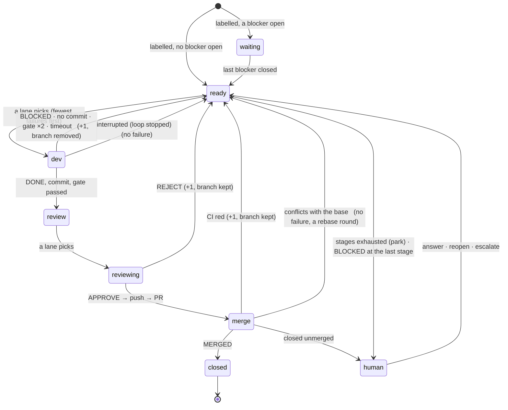

# The bead state machine: every state, every exit

What the supervisor in `src/` does with a bead, state by state: by outcome first, then
every transition. `test/run.sh` drives the binary through each with stub tools.

> **A bead is always in exactly one place, and every place has an exit that is either
> automatic or a human's, and every wait has a timeout that re-reads the world.**

A state with no exit is a deadlock. A wait with no timeout is a deadlock waiting for a
lost signal. An infrastructure failure counted as a bead failure is a livelock: the queue
burns through its stages while nothing is wrong with the beads.

## One bead, start to finish

A **round** is worker → gate (one fix round on failure) → reviewer → PR. Three things end
a round early and send the bead **back to the dev queue**, each with a note on the bead
saying exactly what happened and **one more failure** on its count:

- the dev lane itself: the worker says `BLOCKED:`, makes no commit, times out, or the
  gate fails twice — the branch is removed and the next round starts fresh;
- the review lane: `REJECT:` — the branch and its worktree are *kept*; the next round's
  worker is told to fix its commit in place, and the reviewer sees the fix on top;
- the merge queue: CI red — same branch, kept; the next round's push updates the same PR.

Two send-backs are not failures. A PR that **conflicts with the base** is nobody's
mistake: it goes back to the dev queue on its branch with a rebase order, and that round's
worker is `conflict_worker` — the last stage's by default, because resolving a conflict
is judgement about two intents, not typing. And **infrastructure is never the bead's
failure**: setup failing, git refusing the worktree, a model harness coming back with
nothing from the model (its server down, or the server answering an error before the
model ran), `gh` or the push refusing — the round did not happen. The bead stays in its
queue **held** with the reason, the lane moves on to the next bead, and the held one is
tried again five minutes later (`BEAD_LOOP_HOLD_BACKOFF`).

The failure count chooses the **stage** ([config.md](config.md#stages)). Both queues are
ordered **fewest failures first**, then bd's own order: everything is tried once before
anything is tried twice, and a bead that keeps failing gets out of the way of the ones
that do not. The next round's worker reads the notes of the earlier ones.

Three things put a bead in the **human queue** as *parked* (`in_progress`, no more rounds
until you act): the stages are exhausted with `on_exhaust = "park"`, the *last* stage says
`BLOCKED:` — a claim in the bead is false, or a decision is yours — or its PR is closed
unmerged. Before it raises the bead with you, the loop writes the **brief**
([operating.md](operating.md#the-brief)), so what reaches you is a question, not a stack
of notes. A bead *held* is in the human queue too, beside them, with nothing to press.

**One place.** A bead is in exactly one of: the dev queue, a lane, the review queue, the
merge queue, parked. The dev lane never takes a bead that is in review or under a PR,
whatever bd's status says, and `answer`, `escalate` and Reopen refuse a bead in the merge
queue — its PR is what moves it.

The worker never runs `bd`; the bead's text is in its prompt and the supervisor records
every state change in the operator's checkout. `.beads/issues.jsonl` changes there,
uncommitted, for you to commit with your own work.

## What the state is made of

The loop keeps no state of its own beyond files; a bead's state is a function of:

| where | what |
| --- | --- |
| bd | `status` (`open` / `in_progress` / `closed`; `blocked`, `deferred` by hand), the label, blockers (`bd ready` lists only beads with none open), notes |
| `$RS/failures/ID` | the failure count → the stage (`stage_for`); `.rounds.jsonl` the history, one record per send-back |
| `$RS/review/ID` | in the review queue (holds the worker's last line) |
| `$RS/inflight/ID` | in the merge queue (holds the PR url); beside it `.ID.adopted`, `.ID.red`, `.ID.nocheck`, `.ID.fixing`, `.ID.conflict` |
| `$RS/held/ID` | the bead waits on something outside the loop; the file says what |
| `$RS/parked/ID` | the loop's record of a parking: the reason, the stage, the question, the brief |
| `$RS/lane.NAME` | the bead the lane NAME is on (`dev`, `review`, `claude`; or the `[[lanes]]` names) |
| `$RS/rejoin/ID` | `SID worker` or `SID reviewer`: a session still running on the server after a restart, for the lane to wait on instead of starting one |
| `$RS/wt/ID`, branch `bead/ID` (local, origin) | the work |
| GitHub | the PR: none / OPEN (checks pending, green, red, none; mergeable CONFLICTING; mergeState CLEAN, BEHIND, BLOCKED) / MERGED / CLOSED |
| the servers | an opencode session running or orphaned; devbox, acbox, claude, gh reachable or not |

`$RS` is `~/.local/state/bead-loop/<repo>/`.

## The states

| state | on disk | who exits it |
| --- | --- | --- |
| **waiting** | bd `open` + label, a blocker not `closed` | bd, when the blocker closes (a merge, or a human) |
| **ready** | bd `open` + label, no blocker open; none of the markers below | a lane with the worker role whose models match the stage's worker |
| **dev** | `lane.NAME = ID`, bd `in_progress`, `wt/ID` | that lane: to review, or back to ready |
| **review** | `review/ID`, `wt/ID`, bd `in_progress` | a lane with the reviewer role whose models match the stage's reviewer |
| **reviewing** | `review/ID` + `lane.NAME = ID` | that lane: to merge, or back to ready |
| **merge** | `inflight/ID` + PR OPEN, bd `in_progress` | the merge watcher: closed, back to ready, or human |
| **human** | bd `in_progress`, no marker, no worktree (*parked*; `parked/ID` when the loop did it) — or any queue state with `held/ID` | you: answer, reopen, escalate; or, held, the world changing |
| **closed** | bd `closed` | terminal |

Two flags are orthogonal to the state and do not move a bead:

- `.ID.adopted` — a PR the loop did not open; it never sends back, it only closes.
- `held/ID` — the bead is in its queue but something outside the loop must change before
  it moves. Shown in the human queue beside parked beads, still polled, retried after
  `BEAD_LOOP_HOLD_BACKOFF` (300 s), and cleared when the world changes. Held is how the
  loop says "I am waiting on you" without abandoning the bead.

## Invariants

1. **One place.** `ready ∩ review ∩ merge ∩ lane = ∅`. `dev_queue` filters out any id in
   `review/`, `inflight/` or on a lane, whatever bd's status says; `answer`, `escalate`
   and the page's Reopen refuse (with the url) a bead in the merge queue.
2. **Every wait times out and re-reads the world.** Lanes block on the bell with a 60 s
   heartbeat; the merge watcher polls every 30 s while a PR is open (120 s otherwise, for
   adoption); no sleep without a bound. A lost wake costs at most one heartbeat.
3. **Infrastructure is never a bead failure.** Only the model's own outcome counts:
   `BLOCKED:`, no commit, the gate failing twice, the session timing out, `REJECT:`, CI
   red. Setup failing, git refusing the worktree, a harness that comes back with nothing
   from the model, the push or `gh` refusing, Claude signed out: the round did not happen.
   The bead stays where it is, held, and the lane takes the next one.
4. **A round's failure is contained.** No `set -e`: a tool exiting non-zero is a value the
   round handles, and a lane thread that dies is logged and started again after 10 s.
5. **Start is a recovery.** The loop's first act (`recover`, also a command): clear
   `lane.*`, prune worktrees, rejoin any session still running under a worktree (a
   restart) or abort it (a stop), reopen interrupted dev rounds — bd `in_progress` +
   `wt/ID` + no `review/` + no `inflight/` — with no failure, forget the probes.
6. **A stop cuts short, it does not judge.** TERM raises a flag before it aborts the
   sessions; a worker, gate or reviewer that comes back under it leaves the bead as it
   was — no failure, no note. A restart (the deploy's `restart` marker) aborts nothing.

## What each outcome does to the bead

Every row is a case in `test/run.sh`.

| Outcome | Bead | Branch / PR |
| --- | --- | --- |
| Worker `BLOCKED:` | note with the worker's line, +1 failure; dev queue — parked if this was the last stage, with the brief's question | removed (after the brief) |
| No commit, or the session timed out | note, +1 failure; dev queue | removed |
| Setup fails | **held**, no failure: the reason on the bead once; retried after the backoff | removed |
| Git refuses the worktree (the branch checked out elsewhere, a stale registration) | **held**, no failure, with git's words; the lane takes the next bead | not made |
| Harness exits with nothing from the model — no output, or only its own error (the server down, the model not found on it, a 5xx) | **held**, no failure, with the harness's words; the lane takes the next bead | removed (dev; kept once a round had committed) / kept (review) |
| Gate fails twice (one fix round with its output) | note with the errors, +1 failure; dev queue | removed |
| Gate passes | in_progress; review queue | kept, in its worktree |
| Reviewer `REJECT:` (any verdict that is not `APPROVE:`) | note with the rejection, +1 failure; dev queue — the worker fixes in place | kept |
| Reviewer `APPROVE:` | in_progress, comment with the url; merge queue | pushed; PR opened, or the existing one updated |
| Push or `gh pr create` refused | **held** in the review queue with gh's words | pushed / not |
| CI green, `merge = "auto"` | closed with the PR url | squash-merged by the watcher, branch deleted |
| CI green, `merge = "pipeline"` | closed once the pipeline has merged; **held** if it has not after 30 min | labelled `automerge` at open; the pipeline merges |
| CI green, `merge = "manual"` | **held**: yours to merge | PR left open for you |
| CI green / no checks / pending, `merge = "external"` | no hold, no note; the page shows how long | PR left open, awaiting the maintainer |
| CI green, GitHub refuses the merge (branch protection) | **held** with GitHub's state | PR left open |
| CI red | note with the failing checks, +1 failure; dev queue | kept; the next round's push updates the PR |
| CI red on an adopted PR | one note, **held** | left open for whoever opened it |
| CI pending for over two hours | **held**, still polled: is the agent up? | waits |
| No checks reported, five minutes after the PR opened (sooner, its CI has not registered: pending) | one note, **held**: merge it yourself or set `manual` | waits |
| `gh` cannot read the PR | **held** with gh's words, still polled | waits |
| PR conflicts with the base | note, **no failure**; dev queue — the next round is a rebase by `conflict_worker`, told to keep both sides | kept; the push updates the PR |
| Adopted PR conflicts | left alone | whoever opened it rebases |
| A dev-queue bead's `bead/<id>…` PR merged outside the loop (never open when `adopt` looked) | closed with the PR url | already gone |
| Merged, but `bd close` fails | **held** with the url; the PR stays in the queue | merged |
| Failures exhausted (`on_exhaust = "park"`) | in_progress, for you, with the brief's question | removed (after the brief) |
| PR closed unmerged | in_progress, note with the url and the brief's question | gone |
| The loop stopped mid dev round | reopened at the next start, **no failure** (recover) | removed |

`in_progress` covers every state past the dev queue — on a lane, waiting for review, in
CI, parked — and `bd ready` never hands it out again; `bd show` says why. Reopen a parked
bead with `bd update <id> --status open` (or the page's Reopen) once the bead or the
code is fixed.

## Transitions, one per line

### ready → dev → …

| from | event | to | count | branch |
| --- | --- | --- | --- | --- |
| ready | a lane picks, stage found | dev | — | fresh from `origin/BASE`, or the kept branch resumed |
| ready | a lane picks, stages exhausted (`park`) | human (parked, the brief) | — | — |
| ready | the stage's worker is `claude/*`, signed out | ready (held: signed out; re-probed on every wake, Sign in rings the bell) | — | — |
| ready | `work:NAME` names no `[targets.NAME]`, or two `work:` labels (`Repo::for_bead`) | ready (held: no such target) | — | not made |
| ready | a session to rejoin (`rejoin/ID`) | dev, first in the queue; the lane waits on the session | — | as it was |
| dev | `git fetch` fails, or git refuses the worktree | ready (held, with git's words) | — | not made |
| dev | setup fails | ready (held: "setup failed", the output's tail) | — | removed |
| dev | the worker comes back with nothing from the model — no output, or only the harness's error events (server down, a 5xx, the model not found) | ready (held: the harness's words) | — | removed; kept once a round had committed (the gate-fix round) |
| dev | the worker exits non-zero after real work, or times out | ready | +1 | removed |
| dev | `BLOCKED:` | ready · human if the last stage | +1 | removed (after the brief) |
| dev | no commit | ready | +1 | removed |
| dev | gate fails, fix round, gate fails | ready | +1 | removed |
| dev | gate passes | review | — | kept |
| dev | the loop stopped | ready ("round interrupted", at the next start) | — | kept for the resume |
| dev | the loop restarted with the session still running | ready, first, `rejoin/ID` | — | kept, untouched |

### review → reviewing → …

| from | event | to | count | branch |
| --- | --- | --- | --- | --- |
| review | a lane picks | reviewing | — | kept |
| review | the reviewer is `claude/*`, signed out | review (held) | — | kept |
| review | `wt/ID` missing (a hand `worktree remove`) | reviewing, the worktree rebuilt from the branch; held if git refuses | — | rebuilt |
| reviewing | the reviewer comes back with nothing from the model | review (held: the harness's words) | — | kept |
| reviewing | the reviewer exits non-zero after work | ready | +1 | kept |
| reviewing | `REJECT:` | ready | +1 | kept |
| reviewing | `APPROVE:`, push, PR opened or updated | merge | — | pushed |
| reviewing | push refused (someone pushed to `bead/ID`) | review (held: the push's words) | — | kept |
| reviewing | `gh pr create` fails (gh signed out, network) | review (held: gh's words) | — | pushed |
| reviewing | the loop stopped | review (the lane retakes it) | — | kept |
| reviewing | the loop restarted with the session still running | review, `rejoin/ID` | — | kept |

### merge → …

The watcher looks at every `inflight/ID` on each pass.

| from | event | to | count | branch |
| --- | --- | --- | --- | --- |
| merge | `MERGED` | closed | — | deleted |
| merge | `MERGED`, `bd close` fails | merge (held: merged but bd would not close) | — | — |
| merge | `CLOSED` unmerged | human (parked, the url in the question) | — | gone |
| merge | `mergeable = CONFLICTING`, ours | ready (`.fixing`, `.conflict`; a rebase round by `conflict_worker`) | — | kept; the push updates the PR |
| merge | conflicting, adopted | left alone | — | — |
| merge | checks red, ours | ready (`.fixing`) | +1 | kept; the next push updates the PR |
| merge | checks red, adopted | merge (held: not the loop's branch to fix; one note) | — | — |
| merge | green, `auto`, `CLEAN` → `gh pr merge` | closed | — | deleted |
| merge | green, `auto`, `BEHIND` → `update-branch` | merge (CI reruns) | — | updated |
| merge | green, `auto`, GitHub refuses (branch protection) | merge (held: mergeState and why) | — | — |
| merge | green, `pipeline`, not merged within 30 min (`PIPELINE_TIMEOUT`) | merge (held) | — | — |
| merge | green, `manual` | merge (held: yours to merge) | — | — |
| merge | no checks reported five minutes on | merge (held; one note) | — | — |
| merge | green / no checks / pending, `merge = "external"` | **merge (external): awaiting maintainer** — no hold, no note, age shown on the page; exits the same as any merge-queue PR: `MERGED`, `CLOSED` unmerged, red, or conflict | — | — |
| merge | the `pipeline` label cannot be added | merge (held; one note) | — | — |
| merge | pending longer than 2 h (`CI_TIMEOUT`) | merge (held: is the agent up?), still polled | — | — |
| merge | `gh pr view` fails | merge (held: gh's words), still polled | — | — |
| merge | sent back red, then the stages run out | human (parked); the PR stays open, `.fixing` stays, so `adopt` leaves it to the next round | — | kept |

### Beside the merge queue

| event | to |
| --- | --- |
| an open PR on `bead/<id>…` the loop did not open (`adopt = true`, no `.fixing`) | merge (`.adopted`; labelled under `pipeline`) |
| a dev-queue bead whose `bead/<id>…` PR merged before adopt ever saw it | closed with the url (`close_merged_outside_loop`, once per idle bead per reconcile) |

### human → …

| from | event | to | count |
| --- | --- | --- | --- |
| human (parked) | `answer TEXT` | ready, the note in the next prompt | −1 |
| human (parked) | reopen (`bd update --status open`, the page) | ready, count as is | — |
| human (parked) | `escalate` | ready at the last stage (refused while Claude is signed out) | set |
| human (held, any queue) | the reason clears (server back, signed in, CI reports, the pipeline merges) | that queue, flag dropped | — |
| human (held, merge) | `answer` / reopen / `escalate` | refused: in the merge queue at the url; close the PR or wait | — |
| human | a bead depends on this one | its dependents stay **waiting** (bd) | — |

### The loop's own states

| state | how it is known | exit |
| --- | --- | --- |
| stopped | the service inactive (`gpu-mode game`, a hand stop, Off on the page) | `systemctl start` (the keeper timer, a minute later, unless it is stopped too); recovery runs first |
| running | lanes on the bell or on rounds | — |
| a lane dead | its thread's join returns | started again after 10 s; logged |
| a lane paused | `pause.NAME`, read before every round — between repos and before a bead's reviewer round | `resume` rings the bell |
| the binary replaced on disk | the main thread's minute check | re-exec at the next moment no lane is on a round (the deploy restarts the service anyway) |
| Claude signed out | `claude auth status`, cached a minute, forgotten on every wake | Sign in on the page, `claude auth login` |
| another supervisor holds the lock | `flock` on `$STATE_DIR/lock` fails | the second exits; a lane lock (`lock.NAME`) the same per lane |

## The hazard list, checked

Every way a bead or a lane could wait for ever, and what stops it:

| # | how it would get stuck | what stops it |
| --- | --- | --- |
| 1 | a green PR conflicts with the base after another merges | a rebase round by `conflict_worker`, no failure |
| 2 | branch protection blocks the merge | held, in the human list |
| 3 | the pipeline never merges a green PR | held after 30 min; clears if it merges |
| 4 | CI never reports | held after 2 h, still polled |
| 5 | gh signed out, or the network | held with gh's words, still polled |
| 6 | `bd close` fails at merge | inflight kept, held |
| 7 | a reopened bead is also in review or merge | invariant 1 |
| 8 | a model server down | each bead held as its round comes back empty; the lane goes on; nothing charged |
| 9 | setup fails (a registry down) | held, no failure |
| 10 | `bd`/`git`/`gh` error in a round | a value, handled; the bead held where it applies |
| 11 | a dead lane | started again after 10 s |
| 12 | the loop stopped mid round | recovery reopens it, no failure; a restart rejoins the session |
| 13 | orphan sessions after a `kill -9` | aborted at the next start; shown on the page with Abort until then |
| 14 | `review/ID` without a worktree | the worktree rebuilt |
| 15 | Claude signed out | held, re-probed on every wake; Sign in rings the bell |
| 16 | a lost bell wake | the heartbeat |
| 17 | a dependency cycle | bd refuses to add one |
| 18 | disk: one worktree per bead in review | the review queue rarely passes a few; a cap is one config key if it is ever needed |

Nothing in the list needs a human to notice it before the loop does; the human list is
where the loop puts what it cannot do. The human list is **parked ∪ held ∪ decisions**,
each parked bead with its question — the brief's, written before the bead is raised —
its rounds and their logs, and its ways out.

## Not built

- A server down is found one bead at a time (each round comes back empty and is held)
   rather than once per lane with a probe; the lane keeps trying beads until the backoff
   covers them all.
- Disk is not watched.
